# Báo cáo EDA - Những phần đã hoàn thành

_Nguồn báo cáo: chỉ sử dụng nội dung và output đã render trong `EDA.ipynb`. Các hình trong báo cáo được trích trực tiếp từ output ảnh nhúng trong notebook sang thư mục `report_assets/`._

## 1. Tóm tắt phạm vi đã làm

Notebook đã hoàn thành luồng EDA đến phần **khám phá theo thời gian**, bám theo thứ tự:

1. **Data Inventory**: hiểu toàn bộ bảng, grain, nhóm dữ liệu, khóa chính, cột ngày và mục đích dùng.
2. **Column Profiling**: phân loại semantic type, kiểm tra dtype, missing, unique và domain categorical.
3. **Data Quality Checks**: kiểm tra missing, duplicate, time logic, business rules, FK integrity, order lifecycle, consistency giữa `sales.csv` và transaction data, outlier quality.
4. **Distribution Snapshot**: xem phân phối numeric/categorical và các nhóm đóng góp revenue.
5. **Time Pattern Snapshot**: chuẩn bị các bảng/cell phân tích coverage, daily/monthly/yearly sales, orders, returns, traffic, inventory.
6. **Leakage Awareness**: nhận diện nhóm biến có nguy cơ leakage cho bước forecast/modeling sau.

## 2. Data Inventory - Hiểu bộ dữ liệu

Mục tiêu của phần này là trả lời: có những bảng nào, mỗi bảng đại diện cho grain gì, bảng nào thuộc group master/transaction/analytical/operational và bảng nào cần aggregate trước khi join.

**Bảng tổng quan dữ liệu**

|  | table_name | group | rows | columns | primary_key | date_start | date_end | main_usage |
| --- | --- | --- | --- | --- | --- | --- | --- | --- |
| 0 | customers | master | 121930 | 7 | customer_id | 2012-01-17 | 2022-12-31 | Thông tin khách hàng |
| 1 | geography | master | 39948 | 4 | zip | 2012-01-17 | 2022-12-31 | Danh sách mã bưu chính các vùng |
| 2 | inventory | operational | 60247 | 17 | snapshot_date, product_id | 2012-07-31 | 2022-12-31 | Ảnh chụp tồn kho cuối tháng |
| 3 | order_items | transaction | 714669 | 7 | order_id, product_id | 2012-07-31 | 2022-12-31 | Chi tiết từng dòng sản phẩm trong đơn |
| 4 | orders | transaction | 646945 | 8 | order_id | 2012-07-04 | 2022-12-31 | Thông tin đơn hàng |
| 5 | payments | transaction | 646945 | 4 | order_id | 2012-07-04 | 2022-12-31 | Thông tin thanh toán tương ứng 1:1 với đơn hàng |
| 6 | products | master | 2412 | 8 | product_id | 2012-07-04 | 2022-12-31 | Danh mục sản phẩm |
| 7 | promotions | master | 50 | 10 | promo_id | 2013-01-31 | 2022-11-18 | Các chiến dịch khuyến mãi |
| 8 | returns | transaction | 39939 | 7 | return_id | 2012-07-11 | 2022-12-31 | Các sản phẩm bị trả lại |
| 9 | reviews | transaction | 113551 | 7 | review_id | 2012-07-10 | 2022-12-31 | Đánh giá sản phẩm sau giao hàng |
| 10 | sales | analytical | 3833 | 3 | Date | 2012-07-04 | 2022-12-31 | Dữ liệu doanh thu huấn luyện |
| 11 | sample_submission | analytical | 548 | 3 | Date | 2023-01-01 | 2024-07-01 | Định dạng file nộp bài (mẫu) |

_Ghi chú: bảng gốc có 14 dòng, report chỉ hiển thị 12 dòng đầu._

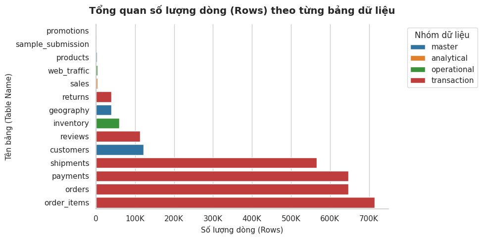

_Số dòng theo từng bảng dữ liệu_

**Kết quả đã làm được**

- Đã tách dataset thành các nhóm master, transaction, analytical và operational.
- Đã ghi rõ grain để tránh join sai cấp độ, đặc biệt với `orders` và `order_items`.
- Đã xác định `sales` là bảng analytical dùng trực tiếp cho Revenue/COGS theo ngày, còn transaction data dùng để kiểm tra/đối chiếu.

## 3. Column Profiling - Hiểu từng cột

Mục tiêu của phần này là biết mỗi cột nên được kiểm tra như numeric, categorical, date, ID, boolean hay text. Đây là bước nền trước missing, duplicate và business rule.

**Column profile summary**

|  | table_name | column_name | semantic_type | pandas_dtype | non_null_count | missing_count | missing_pct | unique_count | unique_pct |
| --- | --- | --- | --- | --- | --- | --- | --- | --- | --- |
| 6 | customers | acquisition_channel | categorical_low_cardinality | object | 121930 | 0 | 0.0 | 6 | 0.005 |
| 5 | customers | age_group | categorical_low_cardinality | object | 121930 | 0 | 0.0 | 5 | 0.004 |
| 2 | customers | city | categorical_high_cardinality | object | 121930 | 0 | 0.0 | 42 | 0.034 |
| 0 | customers | customer_id | id | int64 | 121930 | 0 | 0.0 | 121930 | 100.000 |
| 4 | customers | gender | categorical_low_cardinality | object | 121930 | 0 | 0.0 | 3 | 0.002 |
| ... | ... | ... | ... | ... | ... | ... | ... | ... | ... |
| 89 | web_traffic | date | date | datetime64[ns] | 3652 | 0 | 0.0 | 3652 | 100.000 |
| 92 | web_traffic | page_views | numeric_continuous | int64 | 3652 | 0 | 0.0 | 3620 | 99.124 |
| 90 | web_traffic | sessions | numeric_continuous | int64 | 3652 | 0 | 0.0 | 3447 | 94.387 |
| 95 | web_traffic | traffic_source | categorical_low_cardinality | object | 3652 | 0 | 0.0 | 6 | 0.164 |
| 91 | web_traffic | unique_visitors | numeric_continuous | int64 | 3652 | 0 | 0.0 | 3382 | 92.607 |

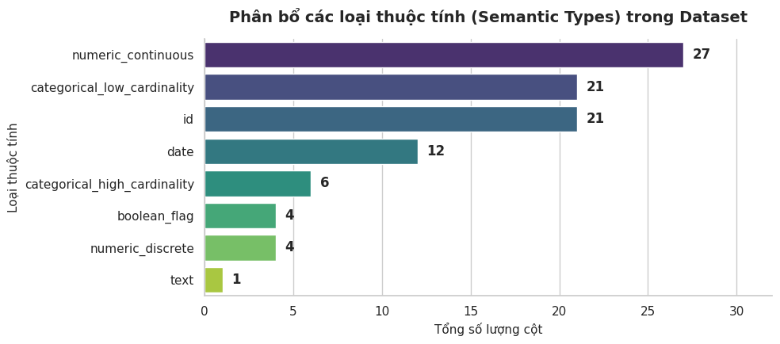

_Phân bổ semantic type trong dataset_

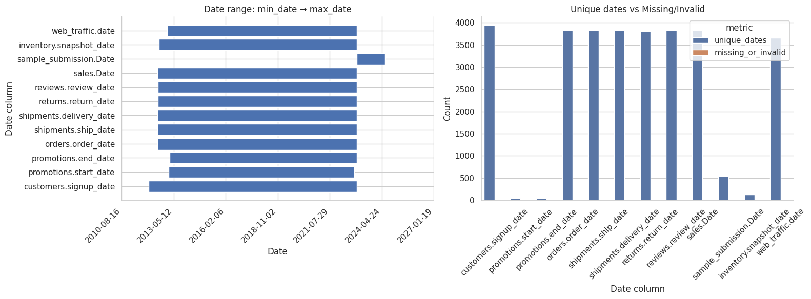

_Date profiling / coverage ban đầu_

**Kết quả đã làm được**

- Đã tạo hồ sơ cột gồm semantic type, pandas dtype, missing, unique và sample values.
- Đã trực quan hóa domain của các cột categorical/boolean để người đọc có thể kiểm tra giá trị bất thường bằng mắt.
- Đã kiểm tra các cột ngày quan trọng để biết bảng nào có thể đưa vào phân tích thời gian.

## 4. Key & Join Readiness - Khóa và quan hệ bảng

Mục tiêu của phần này là biết bảng nào có primary key/candidate key ổn, bảng nào khi join có thể làm nhân dòng.

**Duplicate key / key readiness summary**

|  | table_name | key_columns | rows | unique_keys | duplicate_rows | severity | note |
| --- | --- | --- | --- | --- | --- | --- | --- |
| 5 | order_items | order_id, product_id | 714669 | 714653 | 16 | HIGH | check grain before joining |
| 0 | products | product_id | 2412 | 2412 | 0 | PASS | safe key for this grain |
| 1 | customers | customer_id | 121930 | 121930 | 0 | PASS | safe key for this grain |
| 2 | geography | zip | 39948 | 39948 | 0 | PASS | safe key for this grain |
| 3 | promotions | promo_id | 50 | 50 | 0 | PASS | safe key for this grain |
| 4 | orders | order_id | 646945 | 646945 | 0 | PASS | safe key for this grain |
| 6 | payments | order_id | 646945 | 646945 | 0 | PASS | safe key for this grain |
| 7 | shipments | order_id | 566067 | 566067 | 0 | PASS | safe key for this grain |
| 8 | returns | return_id | 39939 | 39939 | 0 | PASS | safe key for this grain |
| 9 | reviews | review_id | 113551 | 113551 | 0 | PASS | safe key for this grain |
| 10 | inventory | snapshot_date, product_id | 60247 | 60247 | 0 | PASS | safe key for this grain |
| 11 | sales | Date | 3833 | 3833 | 0 | PASS | safe key for this grain |

_Ghi chú: bảng gốc có 14 dòng, report chỉ hiển thị 12 dòng đầu._

**Kết quả đã làm được**

- Đã kiểm tra key theo grain của từng bảng.
- Đã dựng sơ đồ quan hệ bảng trong notebook để giải thích luồng dữ liệu từ master -> transaction -> analytical/operational.
- Đã ghi chú rủi ro join: `orders -> order_items` là quan hệ 1-nhiều nên không join mọi bảng một lúc nếu chưa aggregate.

## 5. Data Quality Checks - Độ tin cậy dữ liệu

Mục tiêu là xác định dữ liệu có đủ tin cậy để tiếp tục EDA và modeling hay không, đồng thời ghi rõ issue nào cần giữ nguyên, flag hoặc điều tra sau.

**Missing summary**

|  | table_name | column | missing_count | missing_pct | interpretation | action | reason |
| --- | --- | --- | --- | --- | --- | --- | --- |
| 1 | order_items | promo_id_2 | 714463 | 99.971 | business-valid missing | Keep as is | Missing means no promotion |
| 2 | promotions | applicable_category | 40 | 80.000 | high missing | Investigate later | Need business meaning before use |
| 0 | order_items | promo_id | 438353 | 61.337 | business-valid missing | Keep as is | Missing means no promotion |

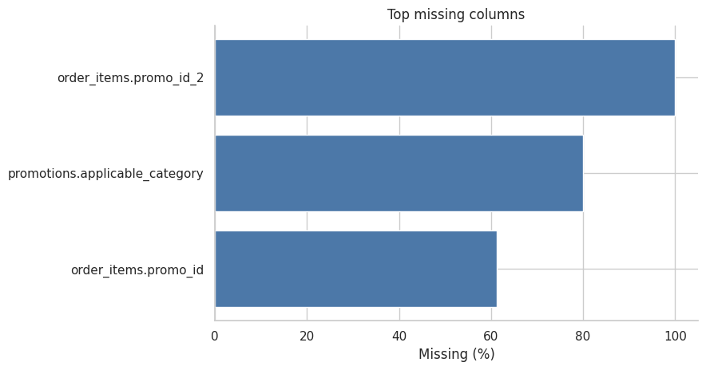

_Top missing columns_

**Duplicate full-row summary**

|  | table_name | rows | duplicate_full_rows | duplicate_full_pct | decision |
| --- | --- | --- | --- | --- | --- |
| 0 | customers | 121930 | 0 | 0.0 | Pass |
| 1 | geography | 39948 | 0 | 0.0 | Pass |
| 2 | inventory | 60247 | 0 | 0.0 | Pass |
| 3 | order_items | 714669 | 0 | 0.0 | Pass |
| 4 | orders | 646945 | 0 | 0.0 | Pass |
| 5 | payments | 646945 | 0 | 0.0 | Pass |
| 6 | products | 2412 | 0 | 0.0 | Pass |
| 7 | promotions | 50 | 0 | 0.0 | Pass |
| 8 | returns | 39939 | 0 | 0.0 | Pass |
| 9 | reviews | 113551 | 0 | 0.0 | Pass |
| 10 | sales | 3833 | 0 | 0.0 | Pass |
| 11 | sample_submission | 548 | 0 | 0.0 | Pass |

_Ghi chú: bảng gốc có 14 dòng, report chỉ hiển thị 12 dòng đầu._

**Time logic checks**

|  | rule | checked_rows | issue_count | issue_pct | severity | note |
| --- | --- | --- | --- | --- | --- | --- |
| 0 | signup_date <= order_date | 646945 | 477453 | 73.8012 | HIGH | customer signs up after order |
| 1 | order_date <= ship_date | 566067 | 0 | 0.0000 | PASS | pass |
| 2 | ship_date <= delivery_date | 566067 | 0 | 0.0000 | PASS | pass |
| 3 | order_date <= return_date | 39939 | 0 | 0.0000 | PASS | pass |
| 4 | order_date <= review_date | 113551 | 0 | 0.0000 | PASS | pass |
| 5 | start_date <= end_date | 50 | 0 | 0.0000 | PASS | pass |

**Business rule checks**

|  | rule | checked_rows | issue_count | issue_pct | severity | note |
| --- | --- | --- | --- | --- | --- | --- |
| 0 | products.price > 0 | 2412 | 0 | 0.0 | PASS | pass |
| 1 | products.cogs >= 0 | 2412 | 0 | 0.0 | PASS | pass |
| 2 | products.price >= cogs | 2412 | 0 | 0.0 | PASS | pass |
| 3 | quantity > 0 | 714669 | 0 | 0.0 | PASS | pass |
| 4 | unit_price > 0 | 714669 | 0 | 0.0 | PASS | pass |
| 5 | discount_amount >= 0 | 714669 | 0 | 0.0 | PASS | pass |
| 6 | discount <= quantity * unit_price | 714669 | 0 | 0.0 | PASS | pass |
| 7 | payment_value >= 0 | 646945 | 0 | 0.0 | PASS | pass |
| 8 | shipping_fee >= 0 | 566067 | 0 | 0.0 | PASS | pass |
| 9 | return_quantity > 0 | 39939 | 0 | 0.0 | PASS | pass |
| 10 | refund_amount >= 0 | 39939 | 0 | 0.0 | PASS | pass |
| 11 | rating between 1 and 5 | 113551 | 0 | 0.0 | PASS | pass |

_Ghi chú: bảng gốc có 20 dòng, report chỉ hiển thị 12 dòng đầu._

**Referential integrity / FK summary**

|  | child_table | fk_column | parent_table | pk_column | checked_rows | orphan_rows | orphan_pct | status | note |
| --- | --- | --- | --- | --- | --- | --- | --- | --- | --- |
| 0 | orders | customer_id | customers | customer_id | 646945 | 0 | 0.0 | PASS | required FK |
| 1 | orders | zip | geography | zip | 646945 | 0 | 0.0 | PASS | required FK |
| 2 | order_items | order_id | orders | order_id | 714669 | 0 | 0.0 | PASS | required FK |
| 3 | order_items | product_id | products | product_id | 714669 | 0 | 0.0 | PASS | required FK |
| 4 | order_items | promo_id | promotions | promo_id | 276316 | 0 | 0.0 | PASS | nullable FK checked only when non-null |
| 5 | order_items | promo_id_2 | promotions | promo_id | 206 | 0 | 0.0 | PASS | nullable FK checked only when non-null |
| 6 | payments | order_id | orders | order_id | 646945 | 0 | 0.0 | PASS | required FK |
| 7 | shipments | order_id | orders | order_id | 566067 | 0 | 0.0 | PASS | required FK |
| 8 | returns | order_id | orders | order_id | 39939 | 0 | 0.0 | PASS | required FK |
| 9 | returns | product_id | products | product_id | 39939 | 0 | 0.0 | PASS | required FK |
| 10 | reviews | order_id | orders | order_id | 113551 | 0 | 0.0 | PASS | required FK |
| 11 | reviews | product_id | products | product_id | 113551 | 0 | 0.0 | PASS | required FK |

_Ghi chú: bảng gốc có 13 dòng, report chỉ hiển thị 12 dòng đầu._

**Kết quả đã làm được**

- Đã phân biệt missing hợp lý nghiệp vụ, ví dụ promotion ID có thể null vì đơn không dùng khuyến mãi.
- Đã kiểm tra duplicate ở mức full row và key.
- Đã kiểm tra logic thời gian như signup/order/ship/delivery/return/review.
- Đã kiểm tra business rules như giá trị dương, rating trong khoảng hợp lệ, discount không vượt gross item value.
- Đã kiểm tra FK để tránh orphan record trước khi join.

## 6. Order Lifecycle Checks - Vòng đời đơn hàng

Mục tiêu là kiểm tra trạng thái đơn hàng có nhất quán với payment, shipment, return và review hay không.

**Order lifecycle summary**

|  | order_status | orders | has_payment_pct | has_shipment_pct | has_return_pct | has_review_pct |
| --- | --- | --- | --- | --- | --- | --- |
| 0 | cancelled | 59462 | 100.0 | 0.00 | 0.00 | 0.00 |
| 1 | created | 7275 | 100.0 | 0.00 | 0.00 | 0.00 |
| 2 | delivered | 516716 | 100.0 | 99.90 | 0.00 | 21.55 |
| 3 | paid | 13577 | 100.0 | 0.00 | 0.00 | 0.00 |
| 4 | returned | 36142 | 100.0 | 99.92 | 99.78 | 0.00 |
| 5 | shipped | 13773 | 100.0 | 99.92 | 0.00 | 0.00 |

**Order lifecycle issue checks**

|  | rule | issue_count | issue_pct | severity | note |
| --- | --- | --- | --- | --- | --- |
| 0 | Đơn đã hủy nhưng vẫn có dữ liệu giao hàng | 0 | 0.0000 | PASS | pass |
| 1 | Đơn báo trả hàng nhưng thiếu chi tiết trong bả... | 80 | 0.0124 | HIGH | Trạng thái là 'returned' nhưng không tìm thấy ... |
| 2 | Đơn báo trả hàng nhưng hệ thống chưa từng giao đi | 29 | 0.0045 | HIGH | Đơn hàng phải được giao đi thành công thì mới ... |
| 3 | Đơn đã giao thành công nhưng thiếu thông tin v... | 524 | 0.0810 | MEDIUM | Thiếu dòng dữ liệu tracking vận chuyển dù đơn ... |
| 4 | Đơn mới tạo/mới thanh toán mà đã có log vận ch... | 0 | 0.0000 | PASS | pass |

**Kết quả đã làm được**

- Đã tính tỷ lệ từng status có payment/shipment/return/review.
- Đã flag các mâu thuẫn như cancelled nhưng có shipment, returned nhưng thiếu return record hoặc delivered nhưng thiếu shipment.
- Phần này giúp quyết định sau này nên tính revenue theo status nào và cần cẩn trọng với status nào.

## 7. Sales Reconciliation - Đối chiếu sales với transaction

Mục tiêu là kiểm tra `sales.csv` có nhất quán với dữ liệu giao dịch không, và Revenue/COGS trong sales gần với công thức transaction nào nhất.

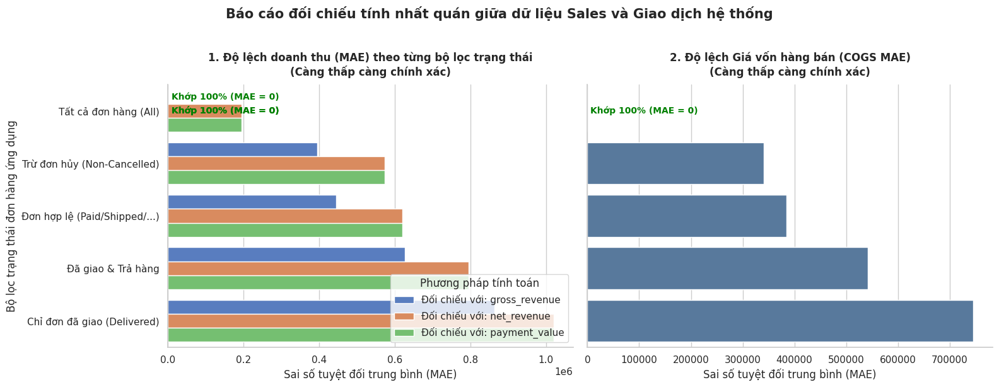

_Đối chiếu độ lệch giữa sales.csv và transaction data_

**Kết quả đã làm được**

- Đã tách Revenue và COGS để so sánh theo nhiều status filter.
- Đã dùng MAE để xem cách tính nào khớp nhất với `sales.csv`.
- Đây là bước quan trọng trước forecast vì nếu target không khớp transaction, cần ghi rõ giả định trong report/modeling.

## 8. Outlier Quality View - Giá trị cực đoan

Mục tiêu là flag outlier ở mức data quality. Outlier chưa được xem là lỗi ngay, nhưng cần biết biến nào có đuôi dài hoặc giá trị cực đoan.

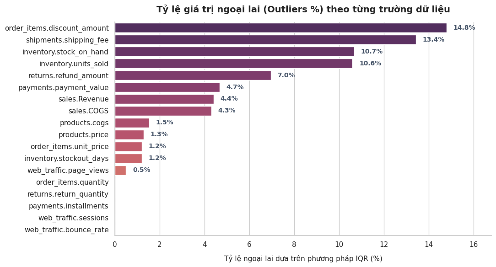

_Tỷ lệ outlier theo trường dữ liệu_

**Outlier quality summary**

|  | table_name | column | method | lower_bound | upper_bound | outlier_count | outlier_pct | min | p1 | median | p99 | max | decision | note |
| --- | --- | --- | --- | --- | --- | --- | --- | --- | --- | --- | --- | --- | --- | --- |
| 4 | order_items | discount_amount | IQR | -1451.445 | 2419.075 | 105767 | 14.799 | 0.000 | 0.000 | 0.000 | 1.104115e+04 | 3.523547e+04 | Flag only | Outlier is not automatically an error |
| 7 | shipments | shipping_fee | IQR | -1.725 | 5.195 | 76050 | 13.435 | 0.000 | 0.040 | 1.730 | 3.129000e+01 | 3.200000e+01 | Flag only | Outlier is not automatically an error |
| 12 | inventory | stock_on_hand | IQR | -277.500 | 502.500 | 6432 | 10.676 | 3.000 | 3.000 | 62.000 | 1.525080e+03 | 2.673000e+03 | Flag only | Outlier is not automatically an error |
| 13 | inventory | units_sold | IQR | -19.000 | 37.000 | 6388 | 10.603 | 1.000 | 1.000 | 6.000 | 1.350000e+02 | 6.700000e+02 | Flag only | Outlier is not automatically an error |
| 9 | returns | refund_amount | IQR | -16389.497 | 36844.882 | 2778 | 6.956 | 458.810 | 635.214 | 7888.880 | 6.667728e+04 | 1.609379e+05 | Flag only | Outlier is not automatically an error |
| 5 | payments | payment_value | IQR | -31356.875 | 72744.285 | 30219 | 4.671 | 389.740 | 1052.669 | 17229.440 | 9.807575e+04 | 3.315704e+05 | Flag only | Outlier is not automatically an error |
| 10 | sales | Revenue | IQR | -1848593.750 | 9670559.770 | 169 | 4.409 | 279813.940 | 845078.752 | 3647303.900 | 1.380199e+07 | 2.090527e+07 | Flag only | Outlier is not automatically an error |
| 11 | sales | COGS | IQR | -1579490.305 | 8367364.455 | 165 | 4.305 | 236576.310 | 738138.756 | 3161112.990 | 1.157411e+07 | 1.653586e+07 | Flag only | Outlier is not automatically an error |
| 1 | products | cogs | IQR | -8709.709 | 14609.692 | 37 | 1.534 | 5.184 | 9.847 | 3184.934 | 1.612482e+04 | 3.890250e+04 | Flag only | Outlier is not automatically an error |
| 0 | products | price | IQR | -11432.158 | 19212.117 | 31 | 1.285 | 9.057 | 16.762 | 4399.605 | 1.953831e+04 | 4.095000e+04 | Flag only | Outlier is not automatically an error |
| 3 | order_items | unit_price | IQR | -6143.415 | 15324.065 | 8623 | 1.207 | 392.570 | 627.870 | 4257.770 | 1.577848e+04 | 4.305600e+04 | Flag only | Outlier is not automatically an error |
| 14 | inventory | stockout_days | IQR | -3.000 | 5.000 | 724 | 1.202 | 0.000 | 0.000 | 1.000 | 7.000000e+00 | 2.800000e+01 | Flag only | Outlier is not automatically an error |

_Ghi chú: bảng gốc có 18 dòng, report chỉ hiển thị 12 dòng đầu._

**Kết quả đã làm được**

- Đã dùng IQR để flag outlier cho các numeric field quan trọng.
- Đã lưu decision dạng “Flag only”, tức chưa loại bỏ vì outlier có thể là hành vi kinh doanh thật.
- Đã phân biệt rule violation với extreme value: rule violation là lỗi logic, outlier chỉ là điểm cần chú ý.

## 9. Distribution Snapshot - Phân phối dữ liệu

Mục tiêu là mô tả hình dạng dữ liệu trước khi suy luận: biến nào lệch, nhóm nào chiếm tỷ trọng cao, revenue tập trung ở đâu.

**Numeric distribution summary**

|  | table_name | column | count | mean | median | min | p25 | p75 | p95 | p99 | max | skew |
| --- | --- | --- | --- | --- | --- | --- | --- | --- | --- | --- | --- | --- |
| 0 | sales | Revenue | 3833 | 4286584.030 | 3647303.900 | 279813.940 | 2471088.820 | 5350877.200 | 9398759.872 | 1.380199e+07 | 2.090527e+07 | 1.670 |
| 1 | sales | COGS | 3833 | 3695134.495 | 3161112.990 | 236576.310 | 2150580.230 | 4637293.920 | 8090775.748 | 1.157411e+07 | 1.653586e+07 | 1.625 |
| 2 | sales | Gross_Profit | 3833 | 591449.535 | 544554.380 | -2567311.720 | 229274.050 | 876080.980 | 1706283.482 | 2.698726e+06 | 4.369414e+06 | 0.235 |
| 3 | sales | Margin | 3833 | 0.125 | 0.178 | -0.575 | 0.083 | 0.203 | 0.225 | 2.440000e-01 | 2.870000e-01 | -2.532 |
| 4 | payments | payment_value | 646945 | 24238.334 | 17229.440 | 389.740 | 7681.060 | 33706.350 | 70870.128 | 9.807575e+04 | 3.315704e+05 | 1.679 |
| 5 | payments | installments | 646945 | 3.448 | 3.000 | 1.000 | 1.000 | 6.000 | 12.000 | 1.200000e+01 | 1.200000e+01 | 1.619 |
| 6 | order_items | quantity | 714669 | 4.496 | 4.000 | 1.000 | 2.000 | 6.000 | 8.000 | 8.000000e+00 | 8.000000e+00 | 0.001 |
| 7 | order_items | unit_price | 714669 | 5114.690 | 4257.770 | 392.570 | 1906.890 | 7273.760 | 11912.290 | 1.577848e+04 | 4.305600e+04 | 1.016 |
| 8 | order_items | discount_amount | 714669 | 1048.887 | 0.000 | 0.000 | 0.000 | 967.630 | 5815.144 | 1.104115e+04 | 3.523547e+04 | 3.382 |
| 9 | products | price | 2412 | 4928.216 | 4399.605 | 9.057 | 59.445 | 7720.514 | 13227.984 | 1.953831e+04 | 4.095000e+04 | 1.330 |
| 10 | products | cogs | 2412 | 3868.347 | 3184.934 | 5.184 | 35.066 | 5864.916 | 10957.599 | 1.612482e+04 | 3.890250e+04 | 1.488 |
| 11 | returns | refund_amount | 39939 | 12784.459 | 7888.880 | 458.810 | 3573.395 | 16881.990 | 42095.649 | 6.667728e+04 | 1.609379e+05 | 2.320 |

_Ghi chú: bảng gốc có 23 dòng, report chỉ hiển thị 12 dòng đầu._

**Categorical distribution summary**

|  | table_name | column | unique_values | top_values |
| --- | --- | --- | --- | --- |
| 0 | orders | order_status | 6 | delivered: 516716 (79.9%); cancelled: 59462 (9... |
| 1 | orders | payment_method | 5 | credit_card: 356352 (55.1%); paypal: 97018 (15... |
| 2 | orders | device_type | 3 | mobile: 291482 (45.1%); desktop: 258855 (40.0%... |
| 3 | orders | order_source | 6 | organic_search: 181495 (28.1%); paid_search: 1... |
| 4 | customers | gender | 3 | Female: 59640 (48.9%); Male: 57457 (47.1%); No... |
| 5 | customers | age_group | 5 | 25-34: 36342 (29.8%); 35-44: 31920 (26.2%); 45... |
| 6 | customers | acquisition_channel | 6 | organic_search: 36450 (29.9%); social_media: 2... |
| 7 | customers | city | 42 | Cam Pha: 4398 (3.6%); Thai Nguyen: 4347 (3.6%)... |
| 8 | products | category | 4 | Streetwear: 1320 (54.7%); Outdoor: 743 (30.8%)... |
| 9 | products | segment | 8 | Activewear: 598 (24.8%); Everyday: 405 (16.8%)... |
| 10 | products | size | 4 | S: 603 (25.0%); M: 603 (25.0%); L: 603 (25.0%)... |
| 11 | products | color | 10 | orange: 242 (10.0%); black: 242 (10.0%); silve... |

_Ghi chú: bảng gốc có 14 dòng, report chỉ hiển thị 12 dòng đầu._

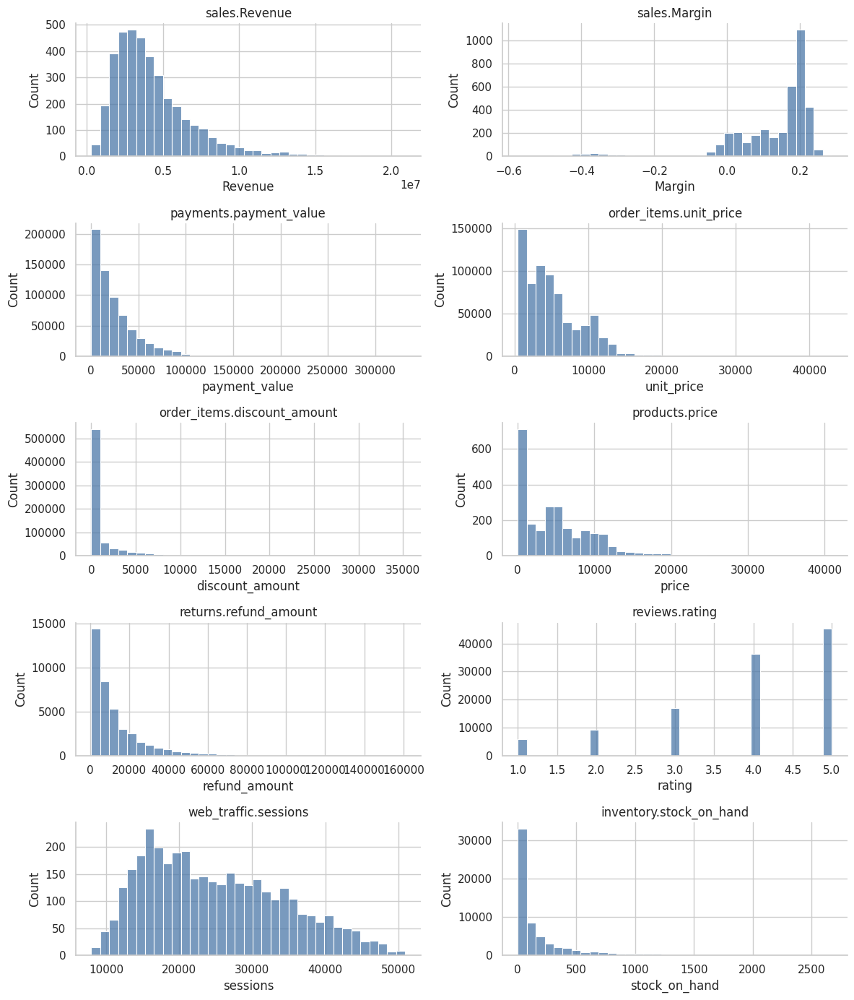

_Phân phối các numeric field quan trọng_

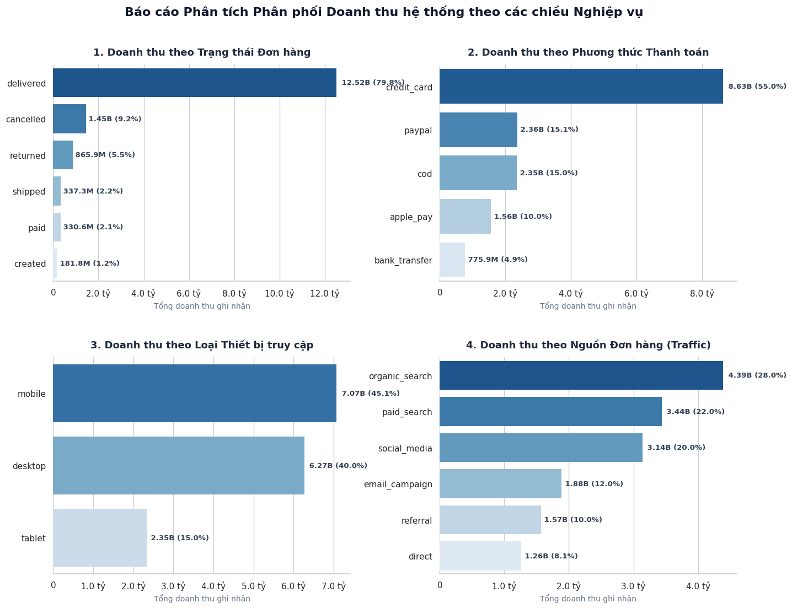

_Revenue theo các chiều order/channel_

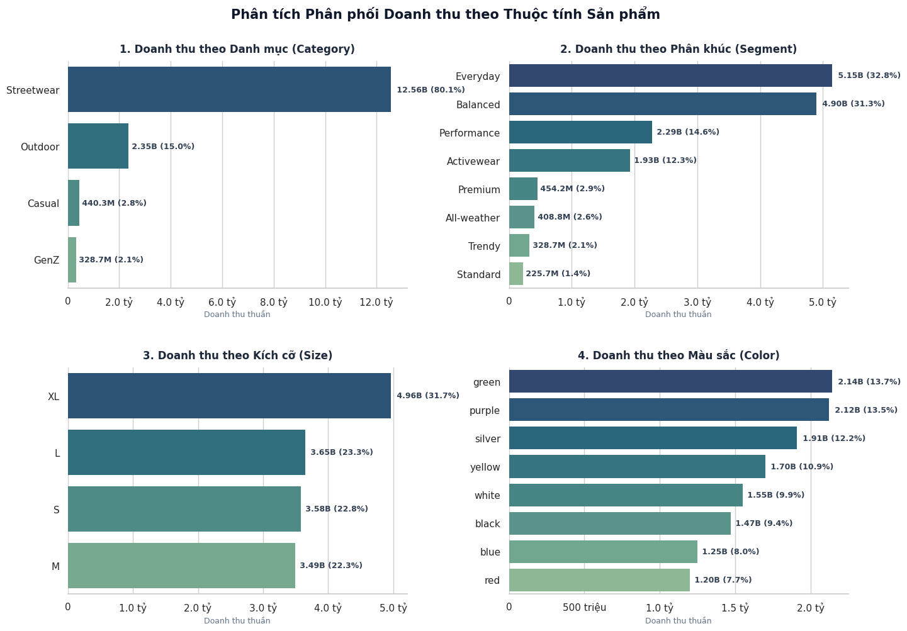

_Revenue theo các thuộc tính sản phẩm_

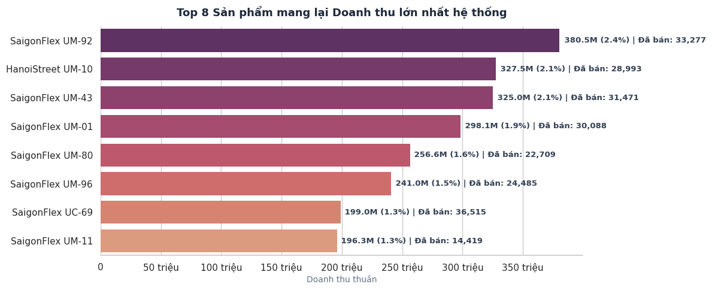

_Revenue theo sản phẩm/top product view_

**Kết quả đã làm được**

- Đã xem phân phối numeric bằng mean/median/percentile/skew.
- Đã xem categorical bằng top values và cardinality.
- Đã phân tích revenue theo order status, payment method, device type, order source.
- Đã phân tích revenue theo category, segment, size, color và sản phẩm.

## 10. Time Pattern Snapshot - Khám phá thời gian

Mục tiêu của phần thời gian là kiểm tra coverage ngày và chuẩn bị các bảng/cell để đọc trend theo ngày, tháng, năm và vận hành.

**Các nội dung đã có trong notebook**

- Time coverage cho các bảng có cột ngày.
- Daily sales với Gross Profit, Margin, rolling 7 ngày và rolling 30 ngày.
- Monthly sales với Revenue, COGS, Gross Profit, Margin, MoM.
- Yearly sales với YoY.
- Orders by status theo tháng.
- Return activity rate theo tháng.
- Web traffic theo ngày/tháng.
- Inventory fill rate và sell-through rate theo tháng.

_Ghi chú kỹ thuật: trong bản `EDA.ipynb` hiện tại, các cell thời gian ở cuối chưa có ảnh output nhúng trong notebook file, nên report không tự chèn được hình cho phần này. Khi cần, chỉ cần chạy lại các cell thời gian trong notebook và generate report lại._

## 11. Leakage Awareness - Chuẩn bị cho modeling

Notebook đã thêm phần nhận diện leakage risk để tránh dùng nhầm biến chỉ biết sau thời điểm dự báo.

**Các nhóm rủi ro đã được ghi nhận**

- Target future values: `sales.Revenue`, `sales.COGS` không dùng làm feature tương lai.
- Post-order outcomes: returns/reviews có rủi ro cao nếu dùng cùng kỳ.
- Operational snapshot: inventory cùng ngày có thể chưa biết tại forecast time.
- Web traffic lag/rolling: có thể dùng nếu chỉ lấy quá khứ.
- Promotions: dùng được nếu campaign calendar đã biết trước.

## 12. Kết luận sau EDA hiện tại

**Đã hoàn thành**

- Có inventory rõ ràng cho các bảng dữ liệu.
- Có column profile để giải thích từng cột thuộc loại nào.
- Có data quality checklist gồm missing, duplicate, key, FK, time logic, business rules, lifecycle, outlier.
- Có reconciliation giữa sales target và transaction data.
- Có snapshot phân phối và revenue contribution theo order/product dimensions.
- Có khung phân tích thời gian và leakage awareness cho bước modeling tiếp theo.

**Cần lưu ý khi trình bày**

- Không join toàn bộ bảng cùng lúc; phải giữ đúng grain.
- `order_items` là bảng dễ làm nhân dòng khi join với `orders`.
- Missing ở promotion ID có ý nghĩa nghiệp vụ, không nên coi là lỗi.
- Outlier nên flag trước, chưa nên loại bỏ nếu chưa có lý do nghiệp vụ.
- Các biến returns/reviews/status cuối vòng đời cần cẩn thận leakage nếu dùng cho forecast.

---

# Phụ lục: toàn bộ hình ảnh trích từ EDA.ipynb

### Hình 1. 1. Data Inventory

_Vẽ số dòng của từng bảng để nhìn nhanh bảng nào lớn nhất và nhóm dữ liệu nào chiếm nhiều volume nhất._

### Hình 2. 2. Column Profiling

_Tóm tắt số lượng cột theo semantic type để hiểu dataset thiên về ID, numeric, categorical, date hay text._

### Hình 3. 2. Column Profiling

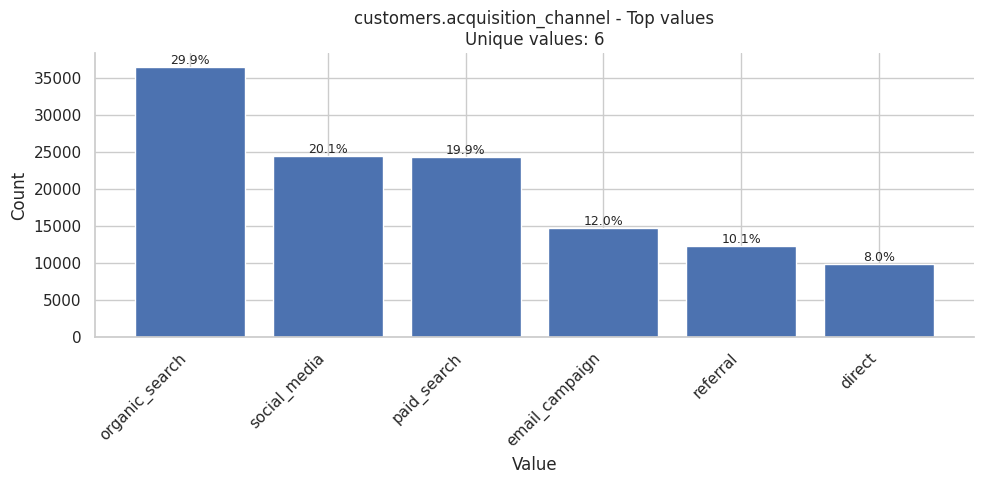

_Hiển thị phân phối giá trị cho các cột categorical/boolean có domain nhỏ để phát hiện domain lệch, giá trị hiếm hoặc cách ghi không nhất quán._

### Hình 4. 2. Column Profiling

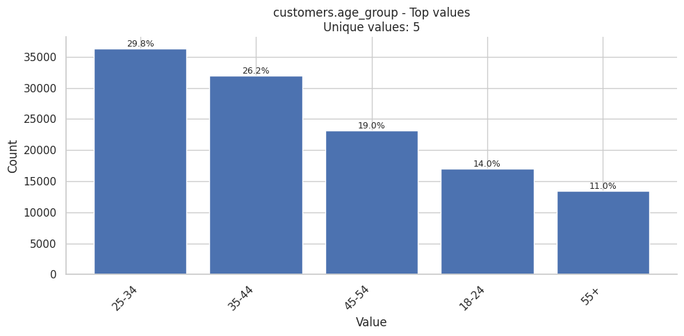

_Hiển thị phân phối giá trị cho các cột categorical/boolean có domain nhỏ để phát hiện domain lệch, giá trị hiếm hoặc cách ghi không nhất quán._

### Hình 5. 2. Column Profiling

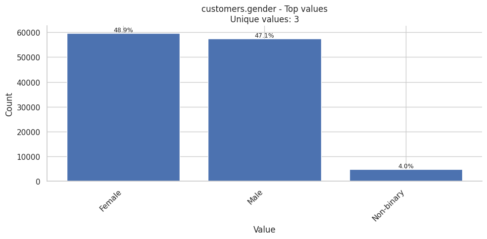

_Hiển thị phân phối giá trị cho các cột categorical/boolean có domain nhỏ để phát hiện domain lệch, giá trị hiếm hoặc cách ghi không nhất quán._

### Hình 6. 2. Column Profiling

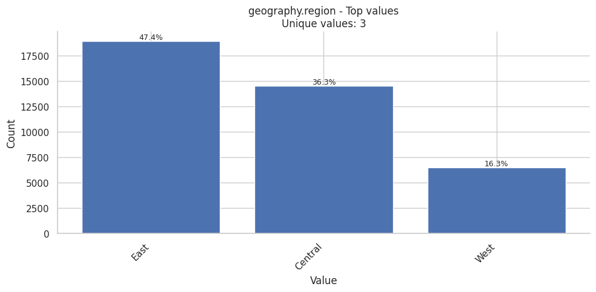

_Hiển thị phân phối giá trị cho các cột categorical/boolean có domain nhỏ để phát hiện domain lệch, giá trị hiếm hoặc cách ghi không nhất quán._

### Hình 7. 2. Column Profiling

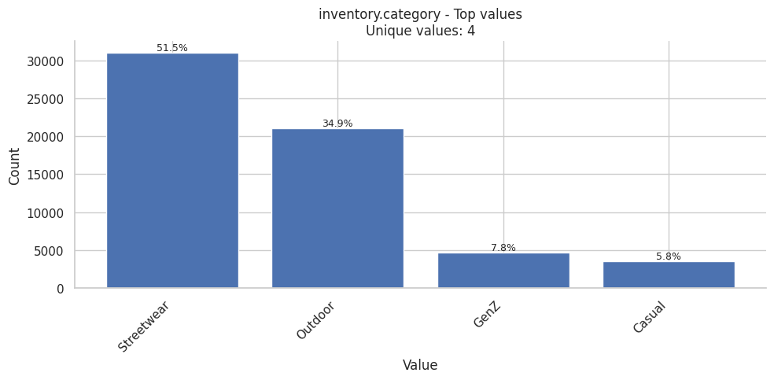

_Hiển thị phân phối giá trị cho các cột categorical/boolean có domain nhỏ để phát hiện domain lệch, giá trị hiếm hoặc cách ghi không nhất quán._

### Hình 8. 2. Column Profiling

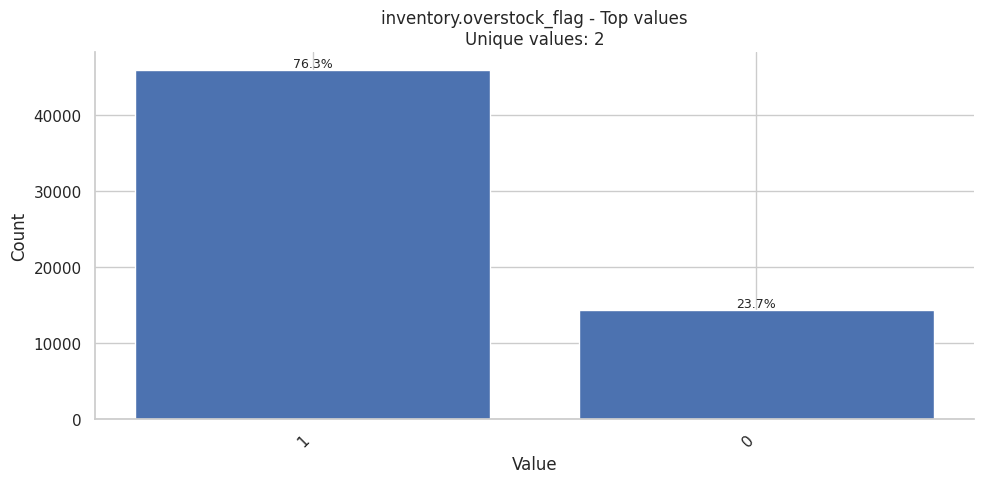

_Hiển thị phân phối giá trị cho các cột categorical/boolean có domain nhỏ để phát hiện domain lệch, giá trị hiếm hoặc cách ghi không nhất quán._

### Hình 9. 2. Column Profiling

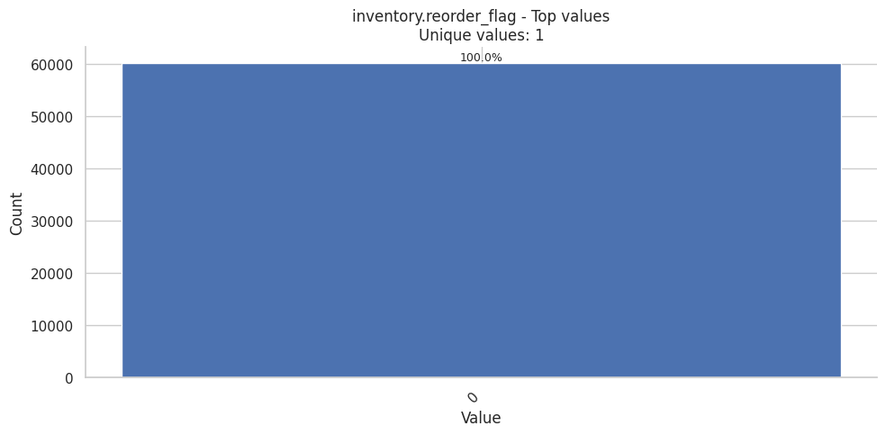

_Hiển thị phân phối giá trị cho các cột categorical/boolean có domain nhỏ để phát hiện domain lệch, giá trị hiếm hoặc cách ghi không nhất quán._

### Hình 10. 2. Column Profiling

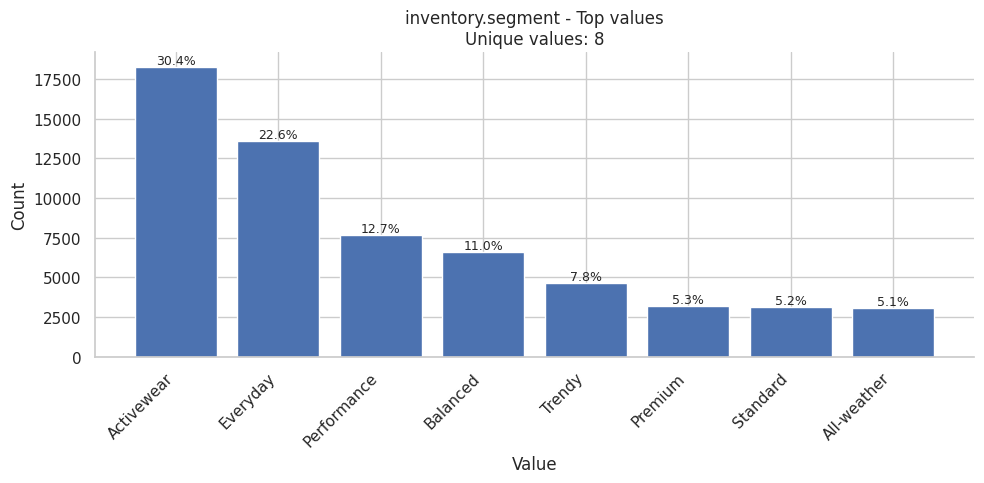

_Hiển thị phân phối giá trị cho các cột categorical/boolean có domain nhỏ để phát hiện domain lệch, giá trị hiếm hoặc cách ghi không nhất quán._

### Hình 11. 2. Column Profiling

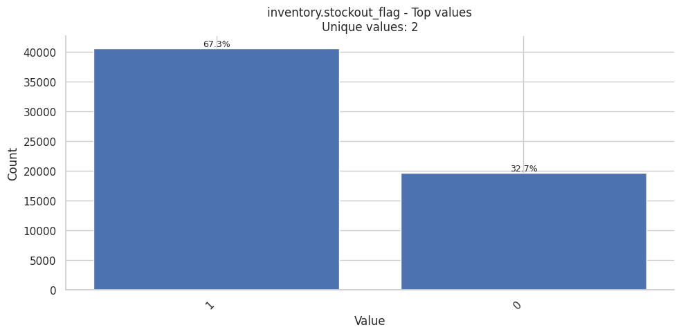

_Hiển thị phân phối giá trị cho các cột categorical/boolean có domain nhỏ để phát hiện domain lệch, giá trị hiếm hoặc cách ghi không nhất quán._

### Hình 12. 2. Column Profiling

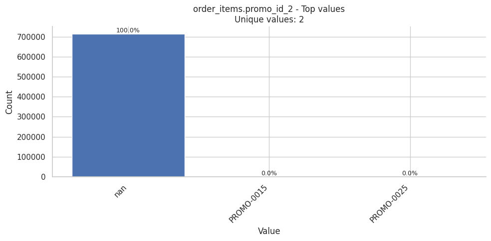

_Hiển thị phân phối giá trị cho các cột categorical/boolean có domain nhỏ để phát hiện domain lệch, giá trị hiếm hoặc cách ghi không nhất quán._

### Hình 13. 2. Column Profiling

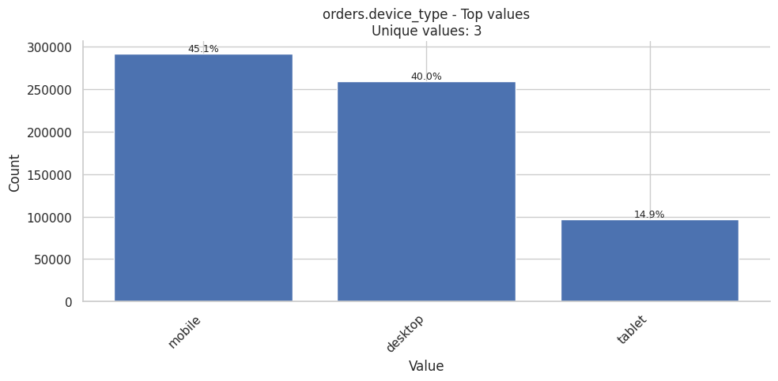

_Hiển thị phân phối giá trị cho các cột categorical/boolean có domain nhỏ để phát hiện domain lệch, giá trị hiếm hoặc cách ghi không nhất quán._

### Hình 14. 2. Column Profiling

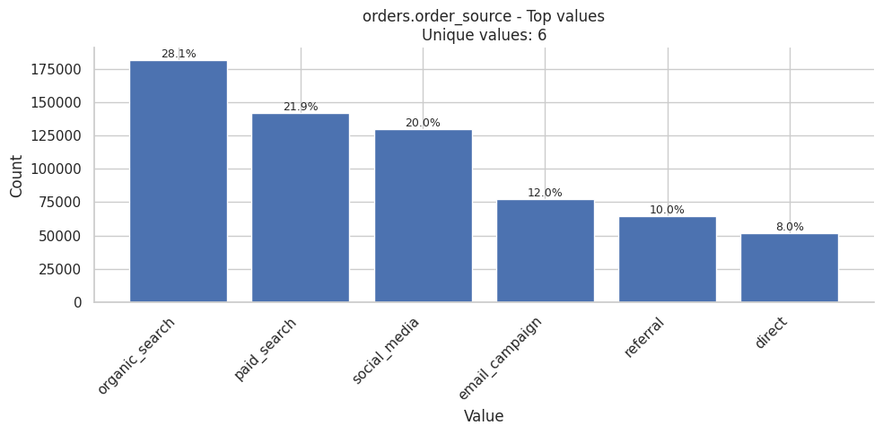

_Hiển thị phân phối giá trị cho các cột categorical/boolean có domain nhỏ để phát hiện domain lệch, giá trị hiếm hoặc cách ghi không nhất quán._

### Hình 15. 2. Column Profiling

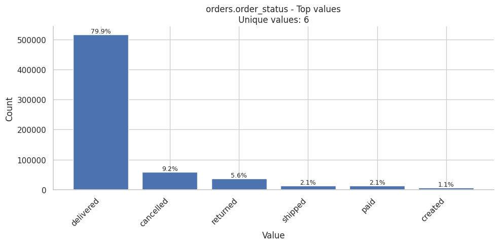

_Hiển thị phân phối giá trị cho các cột categorical/boolean có domain nhỏ để phát hiện domain lệch, giá trị hiếm hoặc cách ghi không nhất quán._

### Hình 16. 2. Column Profiling

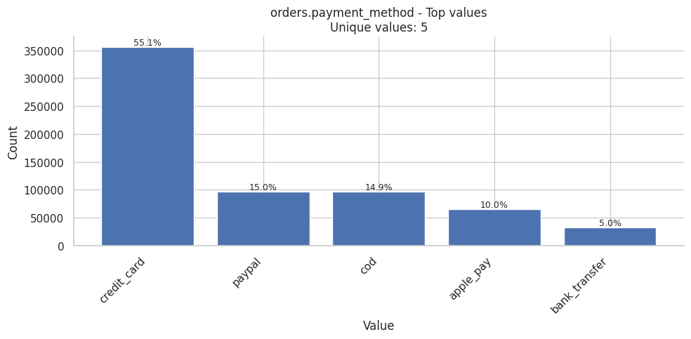

_Hiển thị phân phối giá trị cho các cột categorical/boolean có domain nhỏ để phát hiện domain lệch, giá trị hiếm hoặc cách ghi không nhất quán._

### Hình 17. 2. Column Profiling

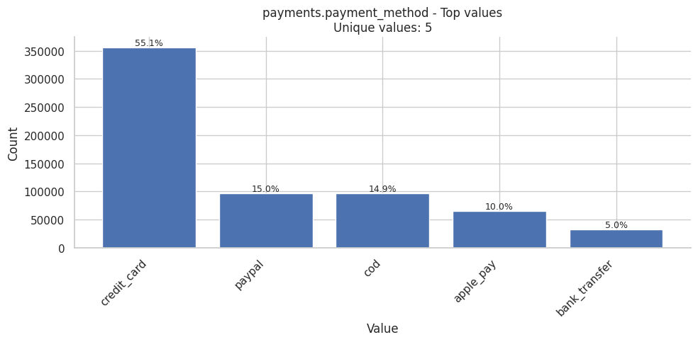

_Hiển thị phân phối giá trị cho các cột categorical/boolean có domain nhỏ để phát hiện domain lệch, giá trị hiếm hoặc cách ghi không nhất quán._

### Hình 18. 2. Column Profiling

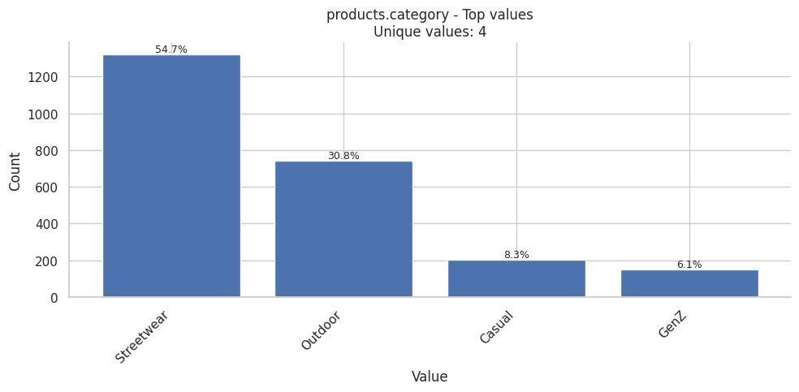

_Hiển thị phân phối giá trị cho các cột categorical/boolean có domain nhỏ để phát hiện domain lệch, giá trị hiếm hoặc cách ghi không nhất quán._

### Hình 19. 2. Column Profiling

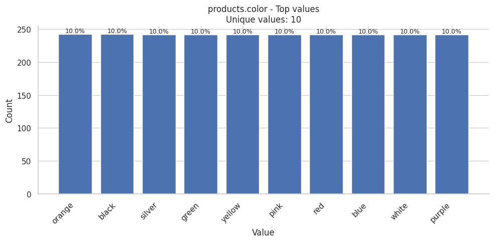

_Hiển thị phân phối giá trị cho các cột categorical/boolean có domain nhỏ để phát hiện domain lệch, giá trị hiếm hoặc cách ghi không nhất quán._

### Hình 20. 2. Column Profiling

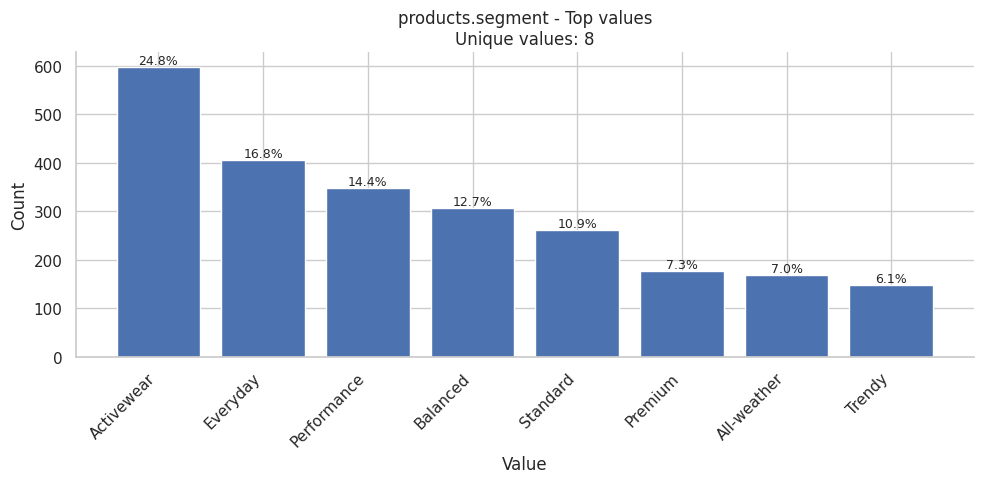

_Hiển thị phân phối giá trị cho các cột categorical/boolean có domain nhỏ để phát hiện domain lệch, giá trị hiếm hoặc cách ghi không nhất quán._

### Hình 21. 2. Column Profiling

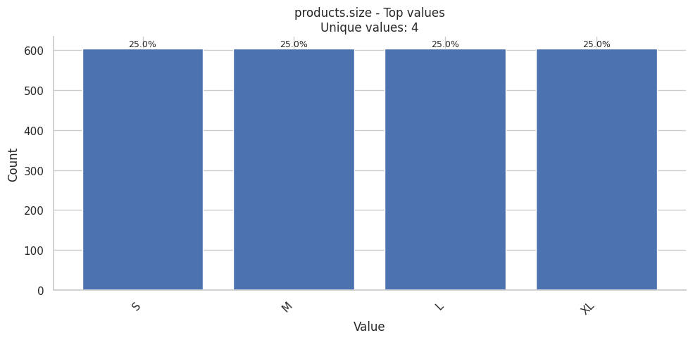

_Hiển thị phân phối giá trị cho các cột categorical/boolean có domain nhỏ để phát hiện domain lệch, giá trị hiếm hoặc cách ghi không nhất quán._

### Hình 22. 2. Column Profiling

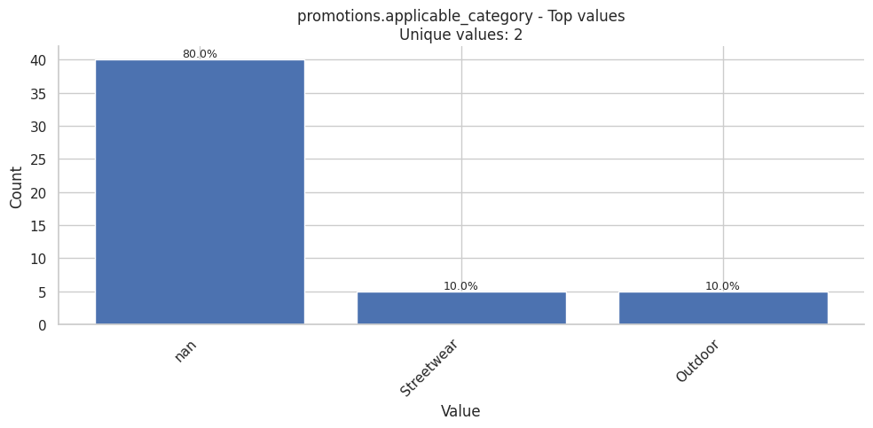

_Hiển thị phân phối giá trị cho các cột categorical/boolean có domain nhỏ để phát hiện domain lệch, giá trị hiếm hoặc cách ghi không nhất quán._

### Hình 23. 2. Column Profiling

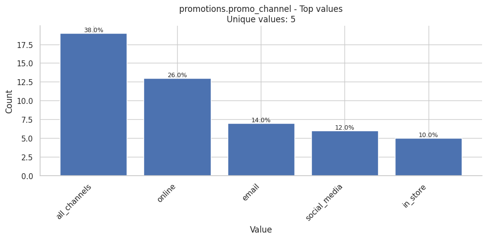

_Hiển thị phân phối giá trị cho các cột categorical/boolean có domain nhỏ để phát hiện domain lệch, giá trị hiếm hoặc cách ghi không nhất quán._

### Hình 24. 2. Column Profiling

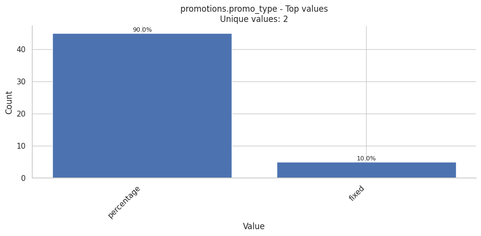

_Hiển thị phân phối giá trị cho các cột categorical/boolean có domain nhỏ để phát hiện domain lệch, giá trị hiếm hoặc cách ghi không nhất quán._

### Hình 25. 2. Column Profiling

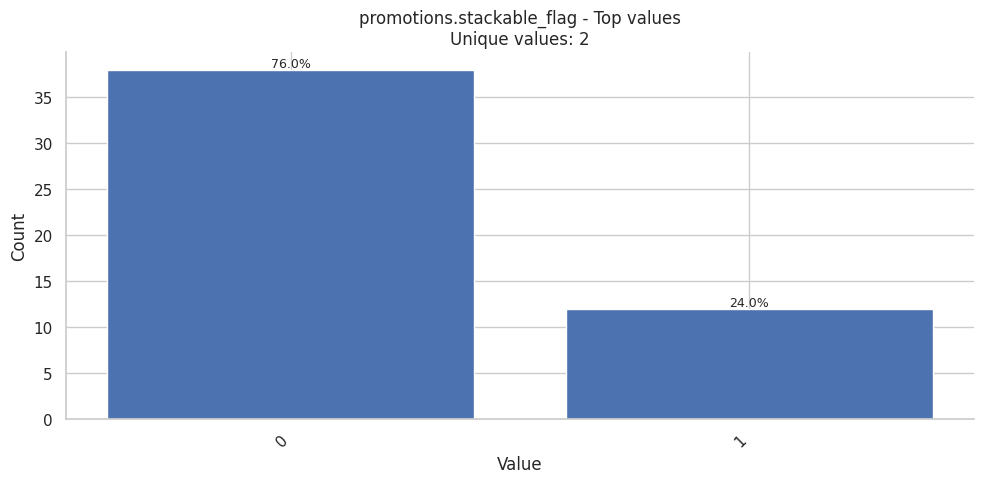

_Hiển thị phân phối giá trị cho các cột categorical/boolean có domain nhỏ để phát hiện domain lệch, giá trị hiếm hoặc cách ghi không nhất quán._

### Hình 26. 2. Column Profiling

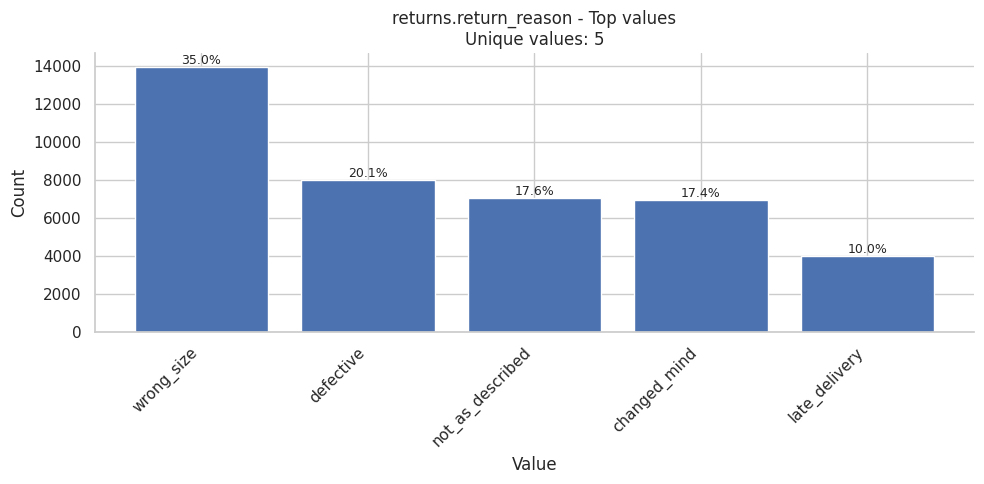

_Hiển thị phân phối giá trị cho các cột categorical/boolean có domain nhỏ để phát hiện domain lệch, giá trị hiếm hoặc cách ghi không nhất quán._

### Hình 27. 2. Column Profiling

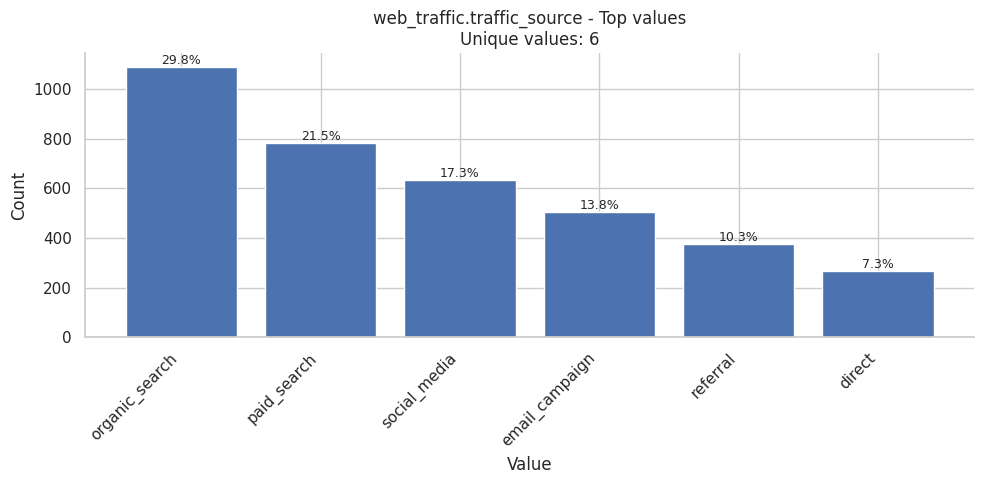

_Hiển thị phân phối giá trị cho các cột categorical/boolean có domain nhỏ để phát hiện domain lệch, giá trị hiếm hoặc cách ghi không nhất quán._

### Hình 28. 2. Date Profiling

_Tổng hợp min date, max date, số ngày unique và số dòng ngày lỗi/missing cho các cột thời gian quan trọng._

### Hình 29. 3. Missing Values

_Vẽ các cột có tỷ lệ missing cao nhất để ưu tiên giải thích/xử lý trong data quality report._

### Hình 30. 3. Sales Reconciliation

_Trực quan hóa độ lệch giữa sales.csv và transaction data để đánh giá sales target khớp với công thức transaction nào nhất._

### Hình 31. 3. Outlier Quality View

_Vẽ tỷ lệ outlier theo từng trường numeric quan trọng để biết cột nào cần flag/investigate nhưng chưa mặc định là lỗi._

### Hình 32. 4. Distribution Snapshot

_Vẽ histogram grid cho các numeric field quan trọng để nhìn nhanh độ lệch, đuôi dài và thang đo của từng biến._

### Hình 33. 4. Revenue by Order Dimensions

_Vẽ doanh thu theo order_status, payment_method, device_type và order_source để hiểu nhóm/kênh nào đóng góp nhiều nhất._

### Hình 34. 4. Revenue by Product Dimensions

_Vẽ doanh thu theo category, segment, size và color để hiểu cơ cấu sản phẩm đóng góp vào revenue._

### Hình 35. 4. Revenue by Product Dimensions

_Vẽ doanh thu theo category, segment, size và color để hiểu cơ cấu sản phẩm đóng góp vào revenue._
