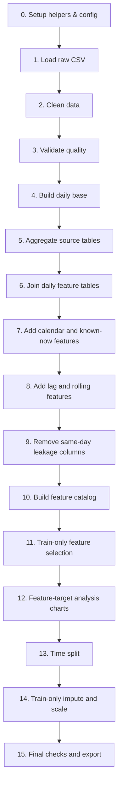
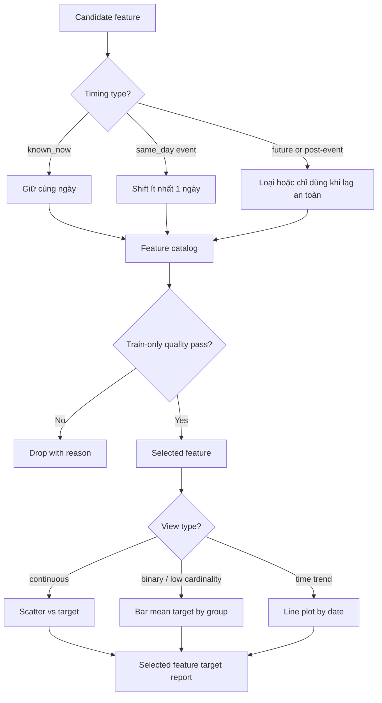

# Kế hoạch Chuẩn bị Dữ liệu (Data Preparation Plan) - Dự báo Doanh thu (Revenue) & Chi phí (COGS) Hàng ngày

Tài liệu này trình bày chiến lược tổng quát, định nghĩa nhãn mục tiêu, danh mục feature được chọn (kèm lý do nghiệp vụ) và kế hoạch triển khai chi tiết từng phần từ dễ đến phức tạp phục vụ bài toán dự báo `Revenue` và `COGS` theo ngày.

---

## 1. Chiến lược tổng quát (General Strategy)

### 1.1. Nguyên tắc cốt lõi
* **Quy trình chuẩn CRISP-DM**: Tập trung vào giai đoạn **Data Preparation** (làm sạch, tích hợp, kỹ nghệ tính năng, định dạng và xuất dữ liệu).
* **Tái sử dụng kết quả EDA**: Không thực hiện lại các bước phân tích khám phá (EDA) đã làm trong báo cáo ngày 28/5. Các thống kê mô tả chỉ nhằm mục đích kiểm tra chất lượng kỹ thuật phục vụ tiền xử lý dữ liệu.
* **Độc lập và bảo mật dữ liệu gốc**: Mọi thao tác xử lý dữ liệu được thực hiện trên bản sao (`clean_tables`). Dữ liệu thô gốc (`raw_tables`) được giữ nguyên để đối chiếu.
* **Thời gian là trục chính (Temporal Consistency)**: Bản chất bài toán là dự báo chuỗi thời gian (Forecasting). Mọi bước từ làm sạch, kỹ nghệ tính năng, chọn tính năng (Feature Selection) đến Imputation/Scaling đều phải được thiết kế để tránh **Rò rỉ dữ liệu tương lai (Data Leakage)**.
* **Lộ trình từ Dễ đến Phức tạp**:
  ```mermaid
  graph TD
      A[Pha 1: Setup & Load Dữ liệu] --> B[Pha 2: Làm sạch & Kiểm tra Lỗi]
      B --> C[Pha 3: Dựng Daily Base & Gom nhóm Aggregation]
      C --> D[Pha 4: Tạo Feature & Chống Leakage]
      D --> E[Pha 5: Chọn Feature dựa trên Train-only]
      E --> F[Pha 6: Định dạng, Impute, Scale & Xuất File]
  ```

---

## 2. Xác định mục tiêu & Nhãn (Target Labels)

Mục tiêu cốt lõi của bài toán là dự báo hai nhãn liên tục hàng ngày:
1. **`Revenue` (Doanh thu thực tế hàng ngày)**: Tổng doanh thu từ các giao dịch bán hàng đã hoàn thành trong ngày.
2. **`COGS` (Cost of Goods Sold - Giá vốn hàng bán thực tế hàng ngày)**: Tổng chi phí gốc của sản phẩm tương ứng với phần Revenue đã ghi nhận.

### Quy tắc xử lý nhãn:
* **Đơn vị phân tích (Grain)**: Một dòng tương ứng với một ngày (`Date`).
* **Tổng hợp target**: Nếu bảng `sales` chứa nhiều bản ghi cho cùng một ngày, các nhãn sẽ được tổng hợp bằng hàm `sum`.
* **Xử lý missing value ở target**: Không tự ý điền (impute) giá trị thiếu cho target. Bản ghi nào thiếu target trong khoảng thời gian huấn luyện (Train period) sẽ bị loại bỏ khỏi tập Train.
* **Khuôn mẫu dự báo (Horizon template)**: Sử dụng cột `Date` từ file `sample_submission.csv` làm mẫu thời gian cần dự báo ở tương lai. Không dùng bất kỳ thông tin nào của `sample_submission` cho quá trình huấn luyện.

---

## 3. Chiến lược chọn Feature & Lý do (Feature Selection & Reason)

Các feature được xây dựng và lựa chọn dựa trên mức độ liên quan nghiệp vụ và tính chất thời gian:

| Nhóm Feature | Nguồn bảng | Loại thời gian (Timing Type) | Rủi ro Leakage | Lý do chọn & Phương án xử lý |
| :--- | :--- | :--- | :--- | :--- |
| **Calendar (Lịch biểu)** | Hệ thống tự sinh | `known_now` (Đã biết trước) | **Thấp** | Xác định tính chu kỳ (ngày trong tuần, tháng, quý, cuối tuần, ngày lễ liên bang). Giúp mô hình bắt được hành vi mua sắm thay đổi theo thời gian thực tế. |
| **Promotions (Khuyến mãi)** | `promotions` | `known_now` (Đã biết trước) | **Thấp** | Các chương trình khuyến mãi thường được lên kế hoạch trước. Số lượng promo kích hoạt và mức giảm giá trung bình giúp dự báo các đợt tăng vọt doanh số (Sales spikes). |
| **Target Lags (Trễ của target)** | `sales` | `lagged` (Quá khứ) | **Thấp** (Nếu lag >= 1) | `Revenue_lag_1d`, `COGS_lag_7d`, v.v. là các tín hiệu mạnh nhất của chuỗi thời gian, đại diện cho quán tính tự tương quan (autocorrelation). |
| **Web Traffic (Lưu lượng web)** | `web_traffic` | `lagged` (Quá khứ) | **Thấp** (Nếu lag >= 1) | Lượng session, visitor và pageview ngày hôm trước tỷ lệ thuận với lượng đơn hàng được chốt ngày hôm sau. |
| **Orders & Items (Đơn hàng)** | `orders`, `order_items` | `lagged` (Quá khứ) | **Thấp** (Nếu lag >= 1) | Số đơn hàng thành công, số lượng sản phẩm bán ra, tổng tiền chiết khấu của ngày hôm trước phản ánh động lực mua sắm gần nhất. |
| **Returns (Hàng trả lại)** | `returns` | `lagged` (Quá khứ) | **Thấp** (Nếu lag >= 1) | Tổng số tiền hoàn và lượng hàng trả lại ảnh hưởng gián tiếp đến dòng tiền doanh thu và điều chỉnh kho. Chỉ dùng lag của quá khứ. |
| **Inventory (Tồn kho)** | `inventory` | `lagged` (Quá khứ - snapshot) | **Thấp** (Nếu snapshot <= dự báo) | Lượng hàng sẵn có trong kho (`stock_on_hand`) giới hạn trần doanh số bán ra. Chỉ dùng snapshot gần nhất tính đến trước ngày dự báo. |
| **Reviews & Customers** | `reviews`, `customers` | Exclude / Conditional | **Trung bình / Cao** | Đánh giá (`reviews`) thường xuất hiện sau khi mua hàng (post-purchase). Khách hàng mới (`customers`) đăng ký cần được lag an toàn. |

> [!WARNING]
> **Nguyên tắc chống rò rỉ dữ liệu**: Các biến thuộc nhóm `lagged` bắt buộc phải dịch chuyển thời gian (shift) ít nhất 1 ngày trước khi tính toán các chỉ số thống kê lăn (rolling window). Không được dùng dữ liệu thực tế phát sinh trong ngày `t` để dự báo target của ngày `t` (ngoại trừ các biến `known_now`).

---

## 4. Kế hoạch chi tiết từng bước (Step-by-step Detailed Plan)

### Pha 1: Thiết lập cấu hình & Tải dữ liệu (Setup & Load Data)
* **Mục tiêu**: Thiết lập môi trường sạch, định nghĩa biến toàn cục nhất quán và load đầy đủ các file CSV.
* **Chi tiết kỹ thuật**:
  1. Sử dụng các biến hằng số chuẩn hóa:
     * `DATE_COL = "Date"` (dùng nhất quán thay vì hard-code chuỗi `"Date"`).
     * `TARGETS = ["Revenue", "COGS"]`.
     * `LAGS = [1, 7, 14, 28, 365]`.
     * `ROLL_WINDOWS = [7, 28, 90]`.
  2. Bảng phân loại file dữ liệu:
     * **Bắt buộc (Required)**: `sales.csv` (chứa target), `sample_submission.csv` (chứa template thời gian dự báo). Nếu thiếu -> Notebook dừng lập tức.
     * **Phụ trợ (Optional)**: `web_traffic.csv`, `orders.csv`, `order_items.csv`, `products.csv`, `returns.csv`, `inventory.csv`, `promotions.csv`, `reviews.csv`, `customers.csv`. Nếu thiếu -> Báo warning, bỏ qua feature liên quan, notebook tiếp tục chạy.
  3. Chuẩn hóa mã hóa (Encoding) và định dạng:
     * Đọc file với `encoding="utf-8-sig"` đề phòng tiếng Việt hoặc ký tự đặc biệt.
     * Strip khoảng trắng ở tên cột: `df.columns = [str(c).strip() for c in df.columns]`.

### Pha 2: Làm sạch & Kiểm tra logic kỹ thuật (Data Cleaning & Validation)
* **Mục tiêu**: Chuẩn hóa kiểu dữ liệu, loại bỏ trùng lặp thực tế, thống kê dữ liệu thiếu và kiểm tra các bất thường nghiệp vụ.
* **Chi tiết kỹ thuật**:
  1. **Đồng bộ kiểu thời gian**: Ép kiểu datetime cho các cột ngày bằng `pd.to_datetime(..., errors="coerce")` và chuẩn hóa về dạng ngày không chứa giờ bằng `.dt.normalize()`. Ghi nhận số lượng dòng lỗi (nếu có).
  2. **Đồng bộ kiểu số**: Ép kiểu số thực/số nguyên bằng `pd.to_numeric(..., errors="coerce")`.
  3. **Xử lý trùng lặp**: Chỉ drop các dòng trùng lặp hoàn toàn (`drop_duplicates()`). Lưu số lượng bị drop vào `duplicate_report`.
  4. **Kiểm tra logic nghiệp vụ (Logic Check)**:
     * Tìm các giá trị âm không hợp lệ ở các cột tiền/số lượng (ví dụ: `Revenue < 0`, `quantity < 0`).
     * Phát hiện ngày có biên lợi nhuận quá thấp (`Revenue < COGS * 0.5`).
  5. **Bối cảnh nghiệp vụ của Outlier**:
     * Đối với các outlier về giá sản phẩm ở cấp độ chi tiết (`order_items`), kiểm tra tỷ lệ `unit_price / cogs` và biên lợi nhuận (`margin_rate`).
     * Phân loại tính hợp lệ: Nếu giá cao đi kèm với giá vốn (`COGS`) cao tương ứng -> Hợp lệ (hàng cao cấp). Nếu giá cao bất thường nhưng COGS cực thấp -> Nghi vấn lỗi nhập liệu.
     * **Nguyên tắc**: Chỉ gắn cờ kiểm tra (`flag_only`), tuyệt đối không tự ý xóa hoặc cap giá trị nếu chưa có phê duyệt từ bộ phận nghiệp vụ.

### Pha 3: Dựng bảng Daily Base & Tích hợp (Aggregation & Base Construction)
* **Mục tiêu**: Xây dựng bảng khung theo ngày và tổng hợp tất cả các nguồn dữ liệu phụ trợ về đúng grain ngày trước khi join để tránh hiện tượng phình dòng (Cartesian product).
* **Chi tiết kỹ thuật**:
  1. Tạo `daily_level_base` từ `sales` bằng cách `groupby(DATE_COL)` và tính `sum` cho `Revenue` và `COGS`.
  2. Với từng bảng phụ trợ (traffic, orders, items, returns, inventory, promotions, reviews, customers):
     * Viết hàm tổng hợp riêng biệt về grain ngày (ví dụ: `sessions` -> `sessions_sum`, `order_id` -> `order_count`).
     * Kiểm tra tính duy nhất của cột ngày sau khi tổng hợp (`unique_dates == total_rows`).
  3. Tiến hành `merge` (left join) các bảng tính năng vào `daily_level_base` dựa trên khóa ngày.
  4. Xuất báo cáo chất lượng join (`join_quality_report`): Kiểm tra số dòng trước/sau join và số ngày không khớp (`unmatched_days`).

### Pha 4: Kỹ nghệ tính năng an toàn (Leakage-Safe Feature Engineering)
* **Mục tiêu**: Tạo ra các biến trễ (lags) và trung bình trượt (rolling mean) mà không làm rò rỉ thông tin tương lai.
* **Chi tiết kỹ thuật**:
  1. Phân loại rõ nhóm biến `known_now` (lịch, promo dự kiến) - giữ nguyên cùng ngày.
  2. Xác định các biến sự kiện phát sinh cùng ngày (`raw_same_day_cols`). Những biến này **bắt buộc** phải dịch chuyển thời gian (shift) trước khi sử dụng.
  3. Viết hàm `add_lag_roll` thực hiện:
     * Dịch chuyển chuỗi gốc: `past = df[col].shift(1)` (hoặc shift theo lag tương ứng).
     * Tạo biến lag trực tiếp: `df[f"{col}_lag_{lag}d"] = df[col].shift(lag)`.
     * Tạo biến rolling trên chuỗi đã dịch chuyển: `df[f"{col}_rolling_{window}d_mean"] = past.rolling(window, min_periods=1).mean()`.
  4. Loại bỏ hoàn toàn các cột cùng ngày thực tế khỏi tập tính năng đầu vào để đảm bảo mô hình không học lén dữ liệu tương lai.

### Pha 5: Danh mục tính năng & Chọn lọc trên tập Train (Feature Catalog & Selection)
* **Mục tiêu**: Định nghĩa rõ ràng vai trò của từng biến và thực hiện việc chọn lọc tính năng một cách khoa học, chỉ dựa trên tập huấn luyện (Train-only) để tránh rò rỉ dữ liệu kiểm thử.
* **Chi tiết kỹ thuật**:
  1. **Xây dựng Feature Catalog**: Tự động sinh bảng ánh xạ chứa thông tin: Tên biến, nguồn gốc, họ tính năng, mức độ rủi ro rò rỉ, và phương pháp điền khuyết dự kiến (`expected_impute_method`).
  2. **Quy trình chọn lọc tính năng (Feature Selection Flow)**:
     * Bước 1: Chia dữ liệu thành tập huấn luyện thô (`train_feature_table`) dựa trên điều kiện `Date < VALID_START_DATE`.
     * Bước 2: Tính toán các chỉ số chất lượng tính năng (`nunique`, `missing_pct`) và tương quan (Pearson/Spearman) **chỉ trên tập huấn luyện thô này**.
     * Bước 3: Áp dụng các quy tắc lọc:
       * Loại bỏ tính năng không đổi (`nunique <= 1`).
       * Loại bỏ tính năng thiếu quá nhiều (`missing_pct >= 95`).
       * Loại bỏ tính năng có số lượng cặp giá trị với target quá ít (`pair_count < 30`).
       * Loại bỏ các tính năng được đánh giá có rủi ro leakage cao.
     * Bước 4: Lưu danh sách `selected_features` và báo cáo lý do chọn/loại (`feature_selection_report`).
  3. **Trực quan hóa phù hợp**:
     * Nhận diện kiểu hiển thị (`infer_feature_view_type`): Continuous (liên tục) vs Binary (nhị phân) vs Low Cardinality (phân loại ít nhóm).
     * Đối với biến liên tục: Vẽ biểu đồ scatter plot kiểm tra quan hệ tuyến tính/phi tuyến với target.
     * Đối với biến phân loại/cuối tuần/ngày lễ: Vẽ biểu đồ cột (`bar`) so sánh giá trị target trung bình giữa các nhóm. Không vẽ scatter plot cho các biến này.

### Pha 6: Chia tập dữ liệu, Điền khuyết, Chuẩn hóa & Xuất file (Format, Format & Export)
* **Mục tiêu**: Tạo ra các file dữ liệu sẵn sàng cho mô hình hóa (model-ready) và xuất báo cáo kiểm tra cuối cùng.
* **Chi tiết kỹ thuật**:
  1. **Chia tập dữ liệu theo thời gian (Time-based Split)**:
     * Tập Train: Các ngày trước `VALID_START_DATE`.
     * Tập Valid: Các ngày từ `VALID_START_DATE` trở đi.
     * Loại bỏ các dòng đầu chuỗi thời gian không đủ độ dài lịch sử phục vụ tính toán lag (ví dụ: các ngày đầu tiên bị NaN do lag 365 ngày).
  2. **Điền khuyết dựa trên Train (Imputation)**:
     * Đọc phương pháp từ `Feature Catalog`.
     * Nếu phương pháp là `fill_0` (cho các biến đếm sự kiện như traffic sum, order count): Điền giá trị `0`.
     * Nếu phương pháp là `train_median` (cho các biến liên tục): Điền giá trị trung vị (`median`) được tính toán **chỉ từ tập Train**, sau đó áp giá trị trung vị này cho cả tập Train và Valid.
     * Nếu phương pháp là `no_impute`: Giữ nguyên giá trị thiếu (để các mô hình như XGBoost/LightGBM tự xử lý).
  3. **Chuẩn hóa dựa trên Train (Scaling)**:
     * Tính toán trung bình (`mean`) và độ lệch chuẩn (`std`) **chỉ từ tập Train**.
     * Thực hiện chuẩn hóa Z-score cho cả tập Train và Valid bằng các thông số huấn luyện này. Bản thô (raw) vẫn được lưu trữ song song.
  4. **Kiểm tra đa cộng tuyến (Multicollinearity)**:
     * Tạo báo cáo `high_corr_report` ghi nhận các cặp biến có độ tương quan chéo quá cao (`corr >= 0.95`).
     * Không tự động xóa biến, chỉ đưa ra cảnh báo và gợi ý hành động (`suggested_action = "review_keep_one_if_linear_model"`).
  5. **Kiểm tra cuối cùng (Final Checks)**:
     * Đảm bảo tập dữ liệu không còn giá trị khuyết (trừ các cột được đánh dấu `no_impute`).
     * Đảm bảo tập Train hoàn toàn nằm trước tập Valid về mặt thời gian.
     * Đảm bảo khóa ngày (`Date`) và các biến target không nằm trong ma trận tính năng `X`.
  6. **Xuất bản dữ liệu**:
     * Lưu trữ toàn bộ các file CSV đã làm sạch và các tập Train/Valid (`X_train_raw.csv`, `X_valid_raw.csv`, `y_train.csv`, `y_valid.csv`, v.v.).
     * Tạo file `export_manifest.csv` lưu trữ thông tin số dòng, số cột, loại file và đường dẫn tuyệt đối của tất cả các file được sinh ra để phục vụ việc audit pipeline.

---

## 5. Ánh xạ biến (Variable Mapping)

Để đảm bảo người viết code (DS Intern) không bị nhầm lẫn giữa các biến trong mã nguồn cũ và các biến chuẩn hóa mới trong kế hoạch này:

| Tên biến trong code cũ (Notebook) | Tên biến chuẩn hóa mới trong Kế hoạch | Phạm vi áp dụng | Ý nghĩa |
| :--- | :--- | :--- | :--- |
| `date_cols` | `DATE_COLS` | Toàn cục (Setup) | Từ điển chứa các cột ngày cần ép kiểu của từng bảng |
| `num_cols` | `NUM_COLS` | Toàn cục (Setup) | Từ điển chứa các cột số cần ép kiểu của từng bảng |
| `outlier_checks` | `OUTLIER_CHECKS` | Toàn cục (Setup) | Danh sách cột cần chạy IQR kiểm tra outlier |
| `feature_schema` | `feature_selection_report` | Pha 5 (Selection) | Báo cáo chi tiết lý do giữ/loại từng feature |
| `corr_report` | `selected_feature_target_report`| Pha 5 (Selection) | Thống kê tương quan của các feature được chọn với target |
| `"Date"` (hard-coded) | `DATE_COL` | Toàn bộ code | Biến hằng số chứa tên cột ngày chính |

---

## 6. Quy hoạch Cell/Shell nhỏ theo Subtask

Mục tiêu của phần này là biến notebook thành một chuỗi cell/shell ngắn, nối tiếp rõ ràng. Mỗi cell/shell chỉ làm **một việc nhỏ** trong phase, không dồn nhiều logic vào một cell dài. Logic phức tạp được đặt trong helper function ở phần Setup; các cell chính chỉ gọi hàm, hiển thị report hoặc vẽ biểu đồ.

### 6.1. Quy tắc chia cell/shell

* **Một cell/shell = một subtask**: Ví dụ load file, convert date, build missing report, vẽ top missing phải là các cell riêng.
* **Tên cell/shell phải có phase và mục đích**: Ví dụ `C12 - Missing report`, `F33 - Add target lag`.
* **Cell/shell nên ngắn**: Ưu tiên 3-10 dòng gọi hàm. Nếu dài hơn, cần tách helper hoặc tách cell.
* **Đầu ra của cell/shell phải rõ**: Mỗi cell nên tạo một artifact, report, bảng trung gian hoặc biểu đồ.
* **Các biểu đồ phải trả lời "vì sao làm bước này"**: Không vẽ cho đẹp. Mỗi chart phải giúp kiểm tra chất lượng, leakage, feature usefulness hoặc readiness để export.
* **Không trộn phase**: Cell thuộc Clean không tạo feature; cell thuộc Feature không impute final; cell thuộc Export không chọn feature lại.

### 6.2. Sơ đồ luồng tổng quát để người đọc hiểu quá trình



### 6.3. Sơ đồ quyết định cho feature và biểu đồ



### 6.4. Danh sách cell/shell đề xuất

| Cell/Shell | Phase | Subtask duy nhất | Input chính | Output chính | Lý do ngắn |
| :--- | :--- | :--- | :--- | :--- | :--- |
| S01 | Setup | Import library | Python env | Libraries loaded | Chuẩn bị môi trường |
| S02 | Setup | Khai báo path output | `DATA_DIR`, `OUT_DIR` | Folder path | Tập trung đường dẫn |
| S03 | Setup | Khai báo target/config | `TARGETS`, `LAGS` | Config constants | Tránh hard-code |
| S04 | Setup | Khai báo danh sách file | File names | `FILES` | Biết file nào bắt buộc |
| S05 | Setup | Khai báo schema cột ngày | Table schema | `DATE_COLS` | Convert date nhất quán |
| S06 | Setup | Khai báo schema cột số | Table schema | `NUM_COLS` | Convert numeric nhất quán |
| S07 | Setup | Tạo helper report | Function code | `show_report` | Giảm lặp display |
| S08 | Setup | Tạo helper plot chung | Function code | Plot helpers | Không viết chart rải rác |
| S09 | Setup | Tạo helper clean | Function code | Clean helpers | Gom logic làm sạch |
| S10 | Setup | Tạo helper feature | Function code | Feature helpers | Gom logic tạo feature |
| S11 | Setup | Tạo helper selection/export | Function code | Selection/export helpers | Tái dùng ở cuối pipeline |
| C12 | Clean | Load CSV | `FILES`, `DATA_DIR` | `raw`, `load_report` | Xác nhận dữ liệu vào |
| C13 | Clean | Hiển thị load report | `load_report` | Report table | Biết file thiếu/có |
| C14 | Clean | Copy raw sang clean | `raw` | `clean` | Không sửa dữ liệu gốc |
| C15 | Clean | Convert date columns | `clean`, `DATE_COLS` | Date parse rows | Chuẩn hóa thời gian |
| C16 | Clean | Convert numeric columns | `clean`, `NUM_COLS` | Numeric rows | Chuẩn hóa số |
| C17 | Clean | Hiển thị type report | Type rows | `type_report` | Tìm lỗi parse |
| C18 | Clean | Build duplicate report | `clean` | `duplicate_report` | Kiểm tra trùng dòng |
| C19 | Clean | Drop full duplicates | `clean` | Clean tables updated | Chỉ loại trùng hoàn toàn |
| C20 | Clean | Build missing report | `clean` | `missing_report` | Đo chất lượng cột |
| C21 | Clean | Vẽ top missing | `missing_report` | Bar chart | Thấy cột thiếu nhiều |
| C22 | Clean | Build logic report | `clean`, `NUM_COLS` | `logic_report` | Bắt lỗi nghiệp vụ |
| C23 | Clean | Build outlier report | `clean` | `outlier_report` | Chỉ flag bất thường |
| C24 | Clean | Vẽ outlier count | `outlier_report` | Bar chart | Ưu tiên review outlier |
| C25 | Clean | Build item margin context | `order_items`, `products` | Context report | Phân biệt lỗi và hàng đắt |
| C26 | Clean | Export clean tables | `clean` | Clean CSV files | Lưu bản đã chuẩn hóa |
| F27 | Feature | Build daily base | `clean["sales"]` | `daily_base` | Tạo grain ngày |
| F28 | Feature | Vẽ target time series | `daily_base` | Line chart | Hiểu trend target |
| F29 | Feature | Build traffic daily feature | `web_traffic` | `traffic_features` | Gom traffic theo ngày |
| F30 | Feature | Build order daily feature | `orders` | `order_features` | Gom đơn hàng theo ngày |
| F31 | Feature | Build item daily feature | `order_items` | `item_features` | Gom sản phẩm theo ngày |
| F32 | Feature | Build return daily feature | `returns` | `return_features` | Gom hàng trả theo ngày |
| F33 | Feature | Build inventory daily feature | `inventory` | `inventory_features` | Snapshot tồn kho an toàn |
| F34 | Feature | Build promotion daily feature | `promotions` | `promotion_features` | Promo biết trước |
| F35 | Feature | Build review/customer feature | `reviews`, `customers` | Optional features | Chỉ dùng nếu lag an toàn |
| F36 | Feature | Collect feature tables | Source features | `feature_tables` | Gom danh sách bảng |
| F37 | Feature | Check aggregation grain | `feature_tables` | `aggregation_report` | Một ngày một dòng |
| F38 | Feature | Join feature tables | `daily_base`, features | `daily_model`, `join_report` | Tránh phình dòng |
| F39 | Feature | Hiển thị join report | `join_report` | Report table | Kiểm tra mất ngày |
| F40 | Feature | Add calendar features | `daily_model` | Calendar cols | Feature biết trước |
| F41 | Feature | Add target lag features | `daily_model`, `TARGETS` | `target_lag_cols` | Dùng quá khứ target |
| F42 | Feature | Detect same-day raw columns | `daily_model` | `raw_same_day_cols` | Tìm cột dễ leakage |
| F43 | Feature | Add source lag/rolling | Same-day cols | `source_lag_cols` | Dịch event về quá khứ |
| F44 | Feature | Build candidate feature list | Known/lag cols | `candidate_features` | Chỉ giữ feature hợp lệ |
| F45 | Feature | Build leakage audit | Candidate/raw cols | `leakage_audit_table` | Giải thích giữ/loại |
| F46 | Feature | Build feature catalog | Candidate cols | `feature_catalog` | Mỗi feature có lý do |
| S47 | Selection | Split train feature table | `feature_table` | `train_feature_table` | Selection train-only |
| S48 | Selection | Build feature quality report | Train data | `feature_quality` | Missing, unique, pair count |
| S49 | Selection | Select features with reason | Quality/catalog | `selected_features`, report | Không chọn bằng cảm tính |
| S50 | Selection | Build target relation report | Train selected features | `selected_feature_target_report` | Đo liên hệ với target |
| S51 | Selection | Vẽ target distribution | Train data | Histogram | Hiểu phân phối target |
| S52 | Selection | Vẽ selected feature charts | Selected features | Scatter/bar charts | Mỗi feature có chart phù hợp |
| S53 | Selection | Vẽ feature source summary | Catalog | Count chart | Thấy feature đến từ đâu |
| X54 | Format | Time split model data | `feature_table` | `train`, `valid` | Tách theo thời gian |
| X55 | Format | Make X/y matrices | Train/valid | `X_train_raw`, `y_train` | Chuẩn bị model input |
| X56 | Format | Impute train-valid | X raw, catalog | `X_train`, `X_valid`, report | Impute bằng train-only |
| X57 | Format | Vẽ imputation summary | Impute report | Bar/table | Kiểm tra fill value |
| X58 | Format | Scale train-valid | Imputed X | Scaled X, report | Scale bằng train-only |
| X59 | Format | Build high correlation report | `X_train_scaled` | `high_corr_report` | Cảnh báo trùng thông tin |
| X60 | Format | Optional PCA | Scaled X | PCA tables/report | Chỉ chạy nếu bật config |
| X61 | Export | Build final checks | Final tables | `final_checks` | Chặn lỗi cuối pipeline |
| X62 | Export | Export reports | Reports dict | Report CSV files | Audit lại được |
| X63 | Export | Export model-ready data | Final X/y | Output CSV files | Sẵn sàng modeling |
| X64 | Export | Build export manifest | Output files | `export_manifest` | Theo dõi artifact |

### 6.5. Subnet theo phase

| Subnet | Cell/Shell | Vai trò | Không được làm |
| :--- | :--- | :--- | :--- |
| Setup subnet | S01-S11 | Tạo config và helper | Không load/clean dữ liệu thật |
| Clean subnet | C12-C26 | Chuẩn hóa, kiểm tra, flag lỗi | Không tạo feature model |
| Aggregation subnet | F27-F39 | Dựng daily base và join bảng ngày | Không lag/selection |
| Leakage-safe feature subnet | F40-F46 | Tạo known-now, lag, rolling, catalog | Không impute/scale |
| Selection subnet | S47-S53 | Chọn feature train-only và vẽ phân tích | Không dùng validation để quyết định |
| Format subnet | X54-X60 | Split, impute, scale, kiểm tra correlation | Không thay đổi selected feature |
| Export subnet | X61-X64 | Kiểm tra cuối và xuất artifact | Không phát sinh logic mới |

### 6.6. Bản đồ biểu đồ/report cần có

| Biểu đồ/Report | Cell/Shell | Trả lời câu hỏi | Loại output |
| :--- | :--- | :--- | :--- |
| Load report | C13 | File nào có, file nào thiếu? | Table |
| Type conversion report | C17 | Cột nào parse lỗi? | Table |
| Top missing values | C21 | Cột nào thiếu nhiều nhất? | Bar chart |
| Outlier count | C24 | Cột nào cần review outlier? | Bar chart |
| Target time series | F28 | Revenue/COGS có trend/seasonality không? | Line chart |
| Aggregation report | F37 | Mỗi bảng feature có đúng one row per date không? | Table |
| Join report | F39 | Join có làm mất/thừa ngày không? | Table |
| Leakage audit table | F45 | Feature nào bị loại vì same-day/leakage? | Table |
| Feature catalog | F46 | Feature đến từ đâu và dùng impute gì? | Table |
| Feature quality report | S48 | Feature có đủ dữ liệu trong train không? | Table |
| Selection report | S49 | Vì sao feature được giữ/loại? | Table |
| Selected feature target report | S50 | Feature liên hệ với Revenue/COGS thế nào? | Table |
| Target distribution | S51 | Target có lệch/outlier mạnh không? | Histogram |
| Feature-target charts | S52 | Biểu đồ nào phù hợp với từng feature? | Scatter/bar/line |
| Feature source summary | S53 | Nhóm feature nào đang chiếm nhiều nhất? | Bar chart |
| Imputation summary | X57 | Missing đã được xử lý ra sao? | Table/bar |
| High correlation report | X59 | Feature nào có thông tin trùng mạnh? | Table |
| Final checks | X61 | Dataset cuối đã sẵn sàng chưa? | Table |
| Export manifest | X64 | File nào đã được sinh ra? | CSV manifest |
