# Báo cáo tổng hợp chuẩn bị dữ liệu và train model - 02/06/2026

## 1. Mục tiêu và phạm vi

Báo cáo này trình bày lại toàn bộ quá trình từ **chuẩn bị dữ liệu ngày 01/06/2026** đến **train model ngày 02/06/2026** cho bài toán dự báo theo ngày hai target:

- `Revenue`: doanh thu theo ngày.
- `COGS`: giá vốn theo ngày.

Mục tiêu không chỉ là ghi lại đã chạy được notebook, mà là trả lời 4 câu hỏi chính:

1. Dữ liệu đã được làm sạch và tạo target đúng chưa?
2. Feature có an toàn với bài toán dự báo theo thời gian không?
3. Vì sao chọn 11 feature cuối cùng, và vì sao loại các feature còn lại?
4. Model hiện tại có cải thiện so với baseline không, và kết quả đó gợi ý bước tiếp theo là gì?

Kết luận ngắn:

- Pipeline đã đi đúng hướng: clean data -> tạo target -> tạo feature leakage-safe -> chọn feature -> chia train/test theo thời gian -> train model.
- Bộ feature cuối cùng gọn, dễ giải thích, và có bằng chứng validation.
- Ridge cải thiện WAPE khoảng 9-10% so với baseline `Naive_lag_1d` trên test 2021-2022.
- `Main_model` hiện tại chưa phải LightGBM thật do môi trường thiếu package, nên bước tiếp theo là chạy lại LightGBM trong môi trường đầy đủ.

## 2. Cấu trúc pipeline

Quy trình được tổ chức theo các phase rõ ràng để tránh lẫn giữa chuẩn bị dữ liệu, chọn feature và modeling:

| Phase | Mục tiêu | Kết quả cần đạt |
|---|---|---|
| Phase 1 - Load & kiểm tra sơ bộ | Hiểu dữ liệu nguồn, shape, schema, missing, duplicate | Biết dữ liệu có đủ để xử lý tiếp không |
| Phase 2 - Clean data | Chuẩn hóa dữ liệu trước khi tạo target | Dữ liệu nguồn sạch hơn, ít lỗi kiểu dữ liệu/missing/duplicate |
| Phase 3 - Target engineering | Tạo bảng target daily từ `sales` | Có `Revenue`, `COGS`, `gross_margin`, `margin_rate` theo ngày |
| Phase 4 - Feature engineering | Tạo feature biết trước và feature quá khứ | Có feature table leakage-safe |
| Phase 5 - Feature selection | Lọc từ 491 candidate về feature set gọn | Chốt 11 feature có logic và validation |
| Phase 6 - Train/test split | Chia dữ liệu theo thời gian | Train 2012-2020, test 2021-2022 |
| Phase 7 - Train model | So sánh baseline và model | Đánh giá bằng MAE, RMSE, WAPE |

Điểm quan trọng: notebook ngày 02/06 **không chia lại dữ liệu**, mà chỉ đọc train/test đã xuất từ phần chuẩn bị dữ liệu ngày 01/06. Như vậy trách nhiệm của từng notebook rõ hơn và giảm rủi ro logic chia dữ liệu bị lệch.

## 3. Công thức cần nắm

Các công thức dưới đây giúp người đọc hiểu kết quả trong báo cáo được tính như thế nào.

Ký hiệu:

- `t`: ngày đang xét.
- `x_t`: giá trị feature/source signal tại ngày `t`.
- `y_t`: giá trị thực tế của target tại ngày `t`.
- `y_hat_t`: giá trị dự báo tại ngày `t`.
- `n`: số ngày trong tập đánh giá.

### 3.1. Target và chỉ số kinh doanh

| Chỉ số | Công thức | Ý nghĩa |
|---|---|---|
| `Revenue_t` | `sum(Revenue trong ngày t)` | Tổng doanh thu ngày `t` |
| `COGS_t` | `sum(COGS trong ngày t)` | Tổng giá vốn ngày `t` |
| `gross_margin_t` | `Revenue_t - COGS_t` | Lợi nhuận gộp |
| `margin_rate_t` | `gross_margin_t / Revenue_t` nếu `Revenue_t != 0` | Tỷ lệ lợi nhuận gộp |

### 3.2. Lag và rolling leakage-safe

Lag:

```text
x_lag_k(t) = x(t-k)
```

Rolling mean:

```text
rolling_mean_w(t) = (x(t-1) + x(t-2) + ... + x(t-w)) / w
```

Điểm mấu chốt là rolling phải tính từ `t-1` trở về trước. Nếu dùng cả giá trị ngày `t`, feature sẽ lấy thông tin cùng ngày với target và có nguy cơ leakage.

### 3.3. Tương quan và chọn feature

Spearman correlation:

```text
Spearman(x, y) = Pearson(rank(x), rank(y))
```

Spearman đo quan hệ tăng/giảm theo thứ hạng, phù hợp hơn Pearson khi dữ liệu kinh doanh bị skew hoặc có outlier.

Độ mạnh quan hệ lớn nhất với hai target:

```text
max_abs_spearman
= max(abs(Spearman(feature, Revenue)), abs(Spearman(feature, COGS)))
```

### 3.4. Chuẩn hóa và Ridge

Nếu model cần chuẩn hóa:

```text
x_scaled = (x - mean_train) / std_train
```

`mean_train` và `std_train` chỉ được fit trên train set, không fit trên test.

Ridge Regression:

```text
y_hat = b + w1*x1 + w2*x2 + ... + wp*xp
```

Hàm tối ưu:

```text
min sum((y_i - y_hat_i)^2) + alpha * sum(w_j^2)
```

Phần `alpha * sum(w_j^2)` là regularization L2, giúp hạn chế hệ số quá lớn và giảm overfit.

### 3.5. Metric đánh giá

| Metric | Công thức | Ý nghĩa |
|---|---|---|
| `MAE` | `(1/n) * sum(abs(y_t - y_hat_t))` | Trung bình mỗi ngày model sai bao nhiêu đơn vị tiền |
| `RMSE` | `sqrt((1/n) * sum((y_t - y_hat_t)^2))` | Phạt mạnh các ngày sai lớn |
| `WAPE` | `sum(abs(y_t - y_hat_t)) / sum(abs(y_t))` | Tổng sai số tuyệt đối so với tổng actual |
| Cải thiện tương đối | `(WAPE_baseline - WAPE_model) / WAPE_baseline * 100` | Model giảm lỗi bao nhiêu phần trăm so với baseline |

Trong báo cáo này, WAPE là metric chính vì `Revenue` và `COGS` là đại lượng tiền tệ. WAPE giúp đọc lỗi theo tỷ lệ quy mô business.

## 4. Phase 1-2: Load data, kiểm tra sơ bộ và clean data

### 4.1. Mục tiêu

Trước khi tạo target hoặc feature, cần đảm bảo dữ liệu nguồn không sai kiểu, không bị duplicate hoàn toàn, và missing được xử lý theo logic rõ ràng. Nếu bỏ qua bước này, target daily có thể sai ngay từ đầu, khiến toàn bộ modeling phía sau không đáng tin.

### 4.2. Các việc đã thực hiện

Các bảng nguồn được load gồm các nhóm:

- Bán hàng: `sales`.
- Giao dịch: `orders`, `order_items`, `payments`.
- Vận hành: `shipments`, `returns`, `inventory`.
- Sản phẩm/khách hàng/địa lý: `products`, `customers`, `geography`.
- Hành vi/marketing: `web_traffic`, `promotions`, `reviews`.
- Định dạng dự báo: `sample_submission`.

Các bước clean chính:

- Chuẩn hóa tên cột.
- Chuẩn hóa chuỗi rỗng thành missing.
- Ép kiểu ngày và kiểu số.
- Drop duplicate hoàn toàn.
- Chỉ fill missing khi có ý nghĩa nghiệp vụ rõ ràng, ví dụ `discount_amount = 0` nếu missing.
- Không fill bừa `Revenue` và `COGS` vì đây là nhãn học của model.
- Flag các giá trị âm/nghi vấn để audit thay vì tự động sửa mạnh tay.

### 4.3. Hình phân tích missing sau clean

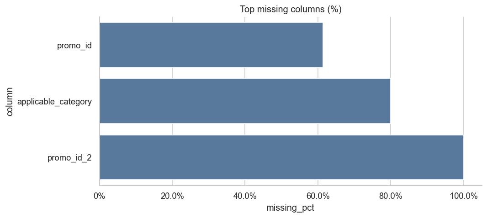

Nhận xét:

- Missing vẫn tồn tại ở một số cột, nhưng đây là điều bình thường với dữ liệu nhiều bảng nguồn.
- Không phải missing nào cũng cần fill. Với feature nguồn, nhiều missing có thể phản ánh ngày không có hoạt động ở bảng đó.
- Cách xử lý đúng là ghi log, phân biệt missing có ý nghĩa nghiệp vụ và missing do lỗi dữ liệu.

Kết luận cho phase này:

- Dữ liệu đã đủ sạch để tạo target.
- Clean data được đặt đúng vị trí: sau load/kiểm tra sơ bộ và trước target engineering.
- Pipeline không dùng các xử lý làm đẹp dữ liệu quá mức, nhờ vậy giảm rủi ro tạo nhãn giả hoặc feature giả.

## 5. Phase 3: Tạo target daily

### 5.1. Mục tiêu

Bài toán được đưa về grain theo ngày. Mỗi dòng tương ứng một ngày, target chính là `Revenue` và `COGS`.

Target được tạo từ bảng `sales` sau khi đã clean:

- `Revenue_t = sum(Revenue trong ngày t)`
- `COGS_t = sum(COGS trong ngày t)`
- `gross_margin_t = Revenue_t - COGS_t`
- `margin_rate_t = gross_margin_t / Revenue_t`

### 5.2. Phân phối target

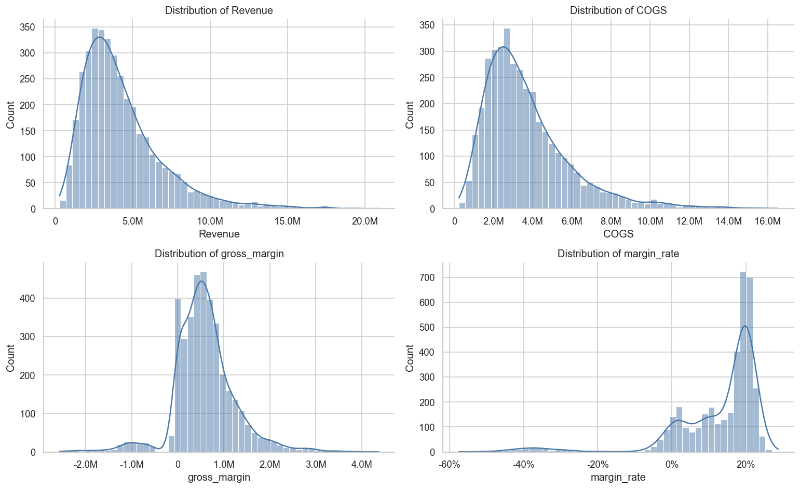

Nhận xét:

- `Revenue` và `COGS` có phân phối lệch phải: phần lớn ngày ở mức trung bình, một số ngày có giá trị rất cao.
- `gross_margin` và `margin_rate` giúp hiểu biên lợi nhuận, nhưng không nên tự động đưa vào feature cùng ngày vì có thể liên quan trực tiếp tới target.
- Phân phối lệch là lý do WAPE phù hợp hơn việc chỉ nhìn MAE, vì WAPE đọc sai số theo quy mô tổng actual.

### 5.3. Xu hướng theo thời gian

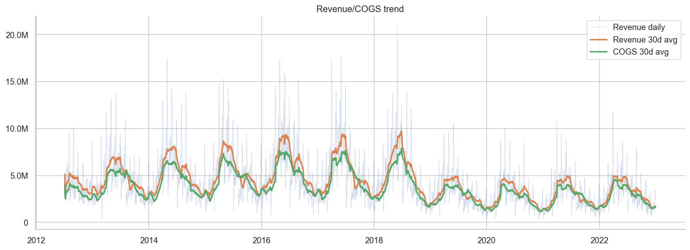

Nhận xét:

- `Revenue` và `COGS` có xu hướng đi cùng nhau, điều này hợp lý vì giá vốn thường tỷ lệ với doanh thu.
- Có các chu kỳ và spike theo thời gian. Đây là lý do cần feature lịch sử như lag/rolling.
- Target có tính liên tục theo ngày, nên baseline `lag_1d` là baseline hợp lý.

### 5.4. Chia train/test theo thời gian

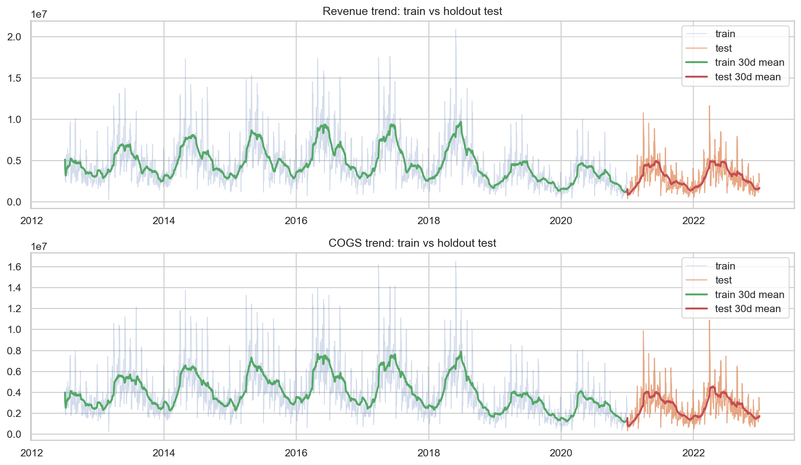

Cách chia:

| Tập | Thời gian | Số dòng | Lý do |
|---|---|---:|---|
| Train | 2012-07-04 -> 2020-12-31 | 3103 | Dùng quá khứ để học |
| Test | 2021-01-01 -> 2022-12-31 | 730 | Dùng tương lai để đánh giá |

Kết luận cho phase target:

- Target đã được tạo đúng sau clean data.
- Train/test chia theo thời gian, không random, phù hợp với forecasting.
- Không có overlap ngày giữa train và test, giảm rủi ro leakage.

## 6. Phase 4: Feature engineering leakage-safe

### 6.1. Mục tiêu

Tạo feature giúp dự báo target nhưng không dùng thông tin tương lai. Trong forecasting, feature chỉ hợp lệ nếu tại thời điểm dự báo nó đã biết hoặc có thể tính từ quá khứ.

Feature được chia thành 4 nhóm:

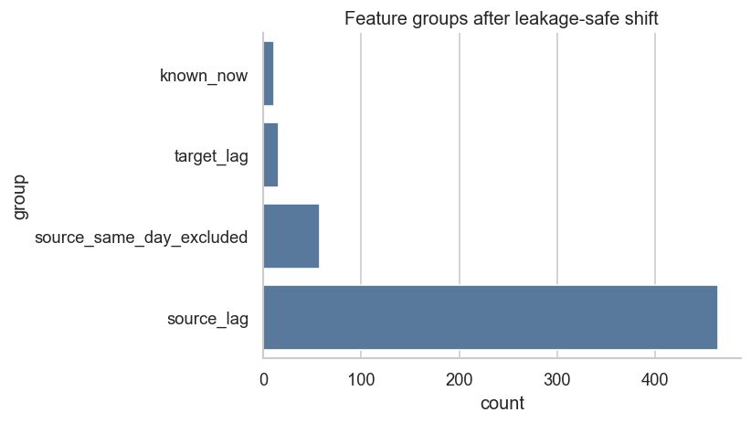

Diễn giải:

| Nhóm | Số lượng | Có dùng trực tiếp không? | Lý do |
|---|---:|---|---|
| `known_now` | 11 | Có | Biết trước khi dự báo, ví dụ lịch/ngày/tháng/promotion đã biết |
| `target_lag` | 16 | Có | Lịch sử target, đã shift về quá khứ |
| `source_same_day_excluded` | 58 | Không dùng trực tiếp | Có nguy cơ chứa thông tin cùng ngày |
| `source_lag` | 464 | Có thể dùng | Source signal đã chuyển thành lag/rolling quá khứ |

Tổng số candidate feature trước selection là **491**.

### 6.2. Vì sao loại same-day operational feature?

Nếu dự báo `Revenue` ngày D, các thông tin như:

- số đơn hàng ngày D,
- số shipment ngày D,
- số return ngày D,
- số review ngày D,
- traffic trong ngày D,

thường chỉ biết sau khi ngày D diễn ra. Nếu đưa trực tiếp vào model, kết quả validation có thể rất đẹp nhưng không dùng được khi dự báo thật.

Kết luận cho phase feature engineering:

- Feature table đã được tạo theo nguyên tắc leakage-safe.
- Các source cùng ngày được ghi nhận để audit nhưng không đưa trực tiếp vào model.
- Nguồn thông tin chính cho model là known-now, target lag và source lag/rolling.

## 7. Phase 5: Feature selection

Đây là phần quan trọng nhất của báo cáo. Từ 491 candidate feature, mục tiêu là chọn một tập feature đủ nhỏ để train model ổn định, nhưng vẫn giữ được các luồng tín hiệu quan trọng.

Quy trình chọn feature:

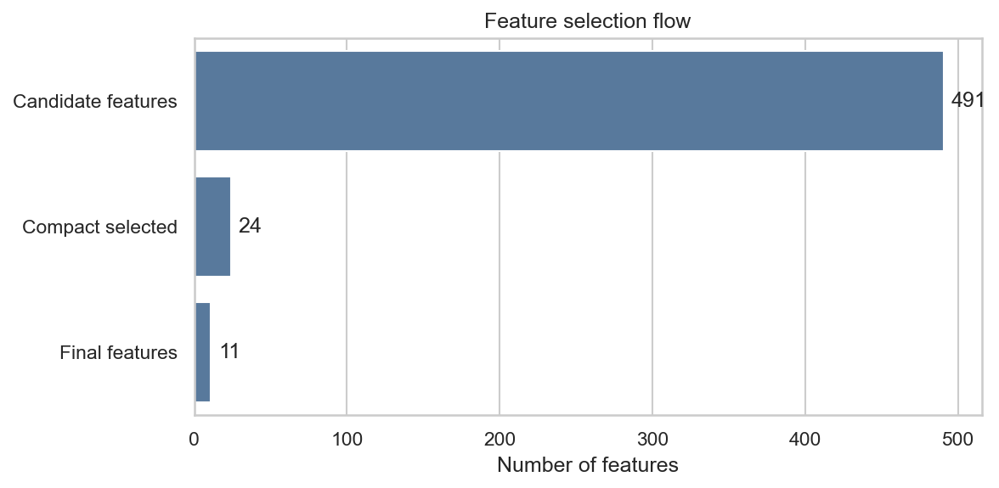

### 7.1. Lớp 1 - Lọc chất lượng feature

Với mỗi feature, notebook tính:

- `missing_pct`
- `nunique`
- `skew`
- `pair_count`
- loại feature liên tục/binary/low-cardinality

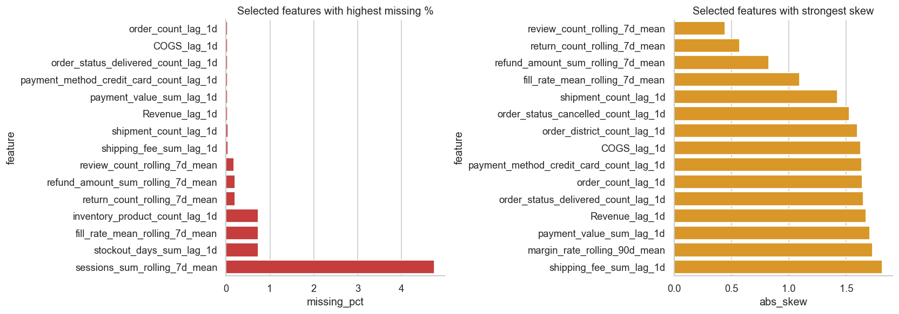

Nhận xét:

- Các feature cuối cùng có missing thấp hoặc chấp nhận được.
- Calendar feature không missing.
- Một số feature return/review có missing nhẹ do không phải ngày nào cũng có hoạt động tương ứng.
- Missing không được dùng làm lý do loại ngay; nó được xem cùng với quan hệ target và validation.

Phân phối các feature liên tục:

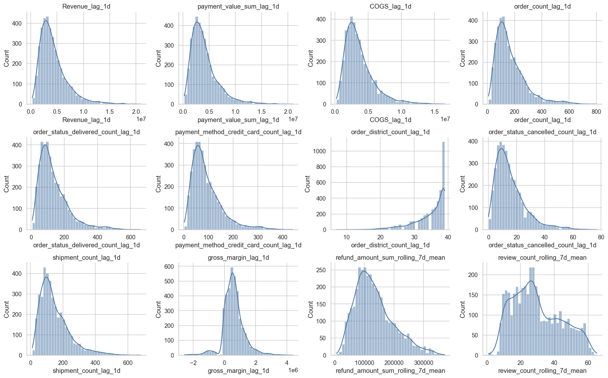

Nhận xét:

- Nhiều feature business bị skew phải, ví dụ payment, order, shipment, refund.
- Điều này giải thích vì sao Spearman hữu ích: nó ít nhạy hơn Pearson trước phân phối lệch và outlier.
- Với model tuyến tính như Ridge, skew có thể ảnh hưởng; với LightGBM, skew thường ít nghiêm trọng hơn nhưng vẫn cần kiểm tra.

### 7.2. Lớp 2 - Đánh giá quan hệ với Revenue và COGS

Notebook tính Spearman và Pearson với cả hai target, sau đó xếp hạng bằng `abs_spearman`.

Top feature theo quan hệ với `Revenue`:

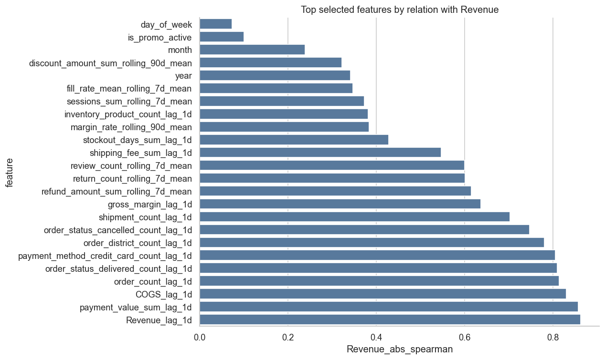

Top feature theo quan hệ với `COGS`:

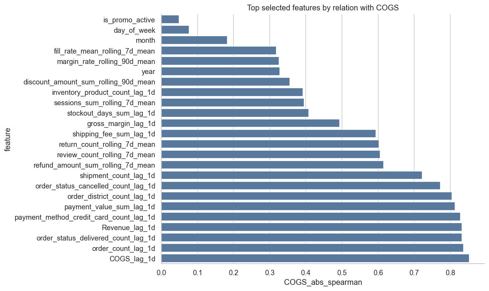

Nhận xét:

- `Revenue_lag_1d` và `COGS_lag_1d` rất mạnh. Điều này khẳng định baseline theo lịch sử target là cần thiết.
- `order_count_lag_1d`, `payment_value_sum_lag_1d`, `shipment_count_lag_1d`, `order_district_count_lag_1d` cũng có tương quan cao.
- Tuy nhiên tương quan cao chưa đủ để giữ feature, vì nhiều biến cùng nói về một tín hiệu business và có thể trùng với target lag.

Scatter với `Revenue`:

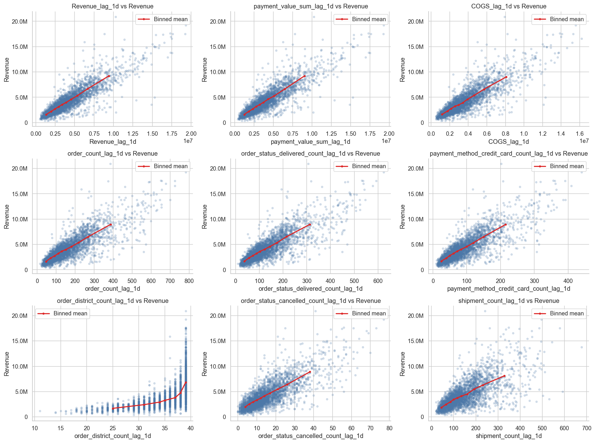

Scatter với `COGS`:

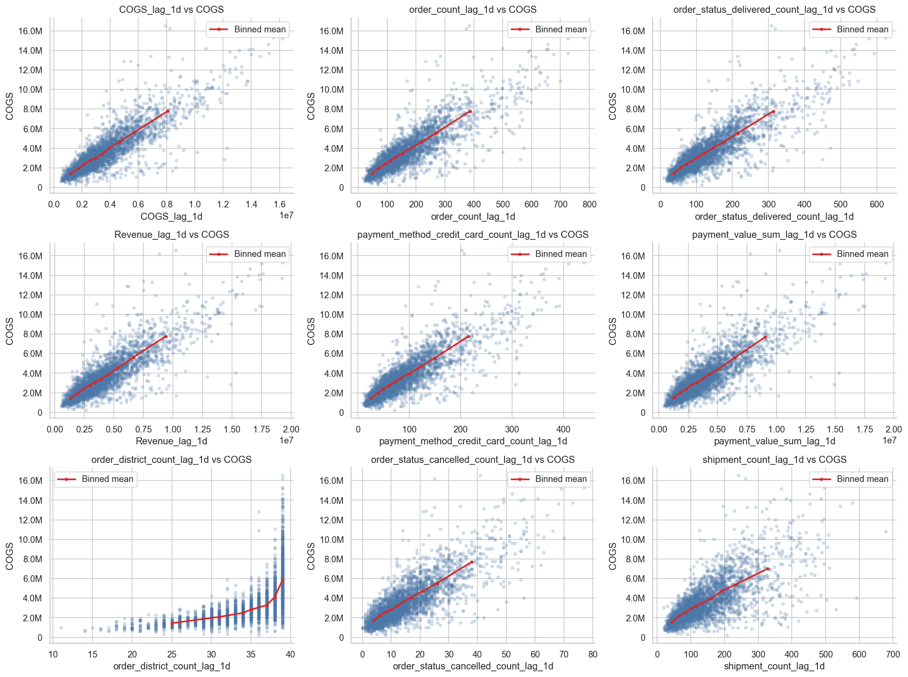

Nhận xét:

- Các feature top có xu hướng tăng cùng target, nhưng vẫn có nhiễu và outlier.
- Quan hệ không hoàn toàn tuyến tính, đặc biệt ở các vùng giá trị lớn.
- Vì vậy bước selection không thể chỉ dựa vào scatter hoặc correlation đơn biến.

### 7.3. Lớp 3 - Hiểu feature theo nhóm tín hiệu

Các feature được gom thành nhóm business signal:

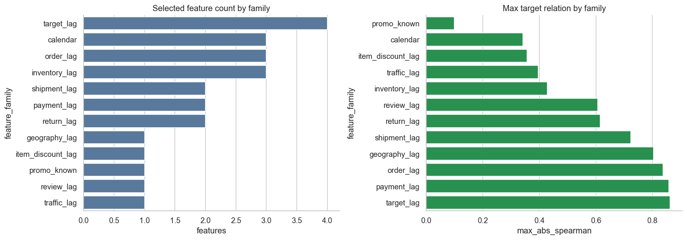

Các nhóm chính:

- `target_lag`: lịch sử doanh thu/giá vốn.
- `order_lag`: nhu cầu mua hàng.
- `payment_lag`: quy mô thanh toán.
- `shipment_lag`: vận hành giao hàng.
- `return_lag`: hoàn trả/hoàn tiền.
- `review_lag`: phản hồi sau bán hàng.
- `geography_lag`: độ phủ địa lý đơn hàng.
- `calendar`: tháng/ngày trong tuần.
- `inventory_lag`, `traffic_lag`, `item_discount_lag`: nhóm tín hiệu bổ sung nhưng chưa chắc tạo gain sau wrapper.

Phân phối độ mạnh theo family:

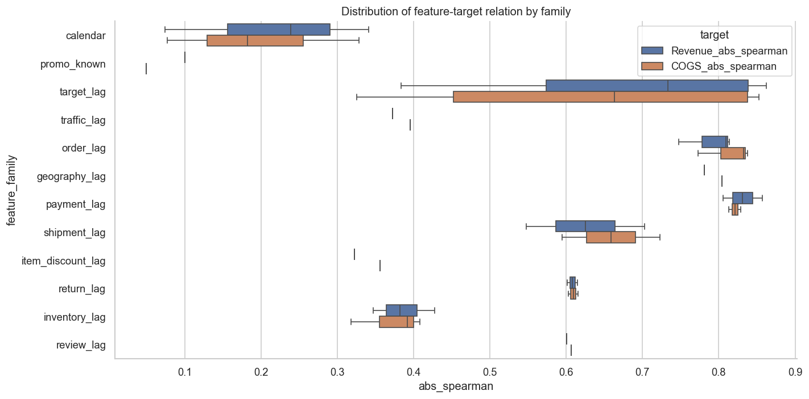

Nhận xét:

- Nhóm target lag, order, payment, shipment có quan hệ mạnh với target.
- Nhưng nhiều nhóm mạnh có thể trùng thông tin với nhau. Ví dụ payment volume và order volume thường cùng tăng khi doanh thu tăng.
- Vì vậy cần bước giữ biến đại diện và kiểm tra redundancy.

### 7.4. Lớp 4 - Redundancy và giữ biến đại diện

Heatmap tương quan:

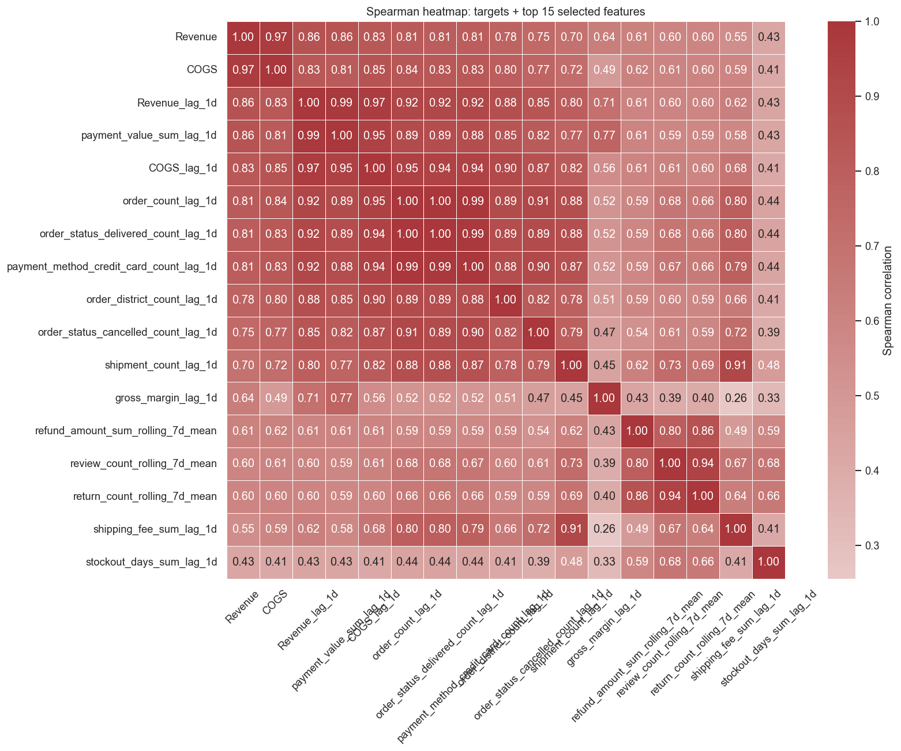

Nhận xét:

- Nhiều feature top có tương quan cao với nhau.
- `Revenue_lag_1d`, `COGS_lag_1d`, `order_count_lag_1d`, `payment_value_sum_lag_1d` cùng nằm trong nhóm tín hiệu volume/quy mô.
- Nếu giữ quá nhiều biến cùng nhóm, model có thể không học thêm thông tin mới mà chỉ tăng độ phức tạp.

"Giữ biến đại diện" nghĩa là:

- Nếu nhiều feature cùng nói về một tín hiệu, chỉ giữ feature đại diện tốt nhất.
- Feature đại diện được chọn dựa trên chất lượng dữ liệu, độ liên hệ target, tính dễ hiểu nghiệp vụ và kết quả wrapper.
- Mục tiêu là giảm trùng lặp, không phải làm mất tín hiệu.

Ví dụ:

| Nhóm tín hiệu | Nhiều feature có thể xuất hiện | Đại diện cuối cùng |
|---|---|---|
| Target history | `Revenue_lag_1d`, `Revenue_lag_7d`, rolling Revenue | `Revenue_lag_1d`, `COGS_lag_1d` |
| Demand volume | order count, delivered count, item count | `order_count_lag_1d` |
| Shipment | shipment count, shipping fee | `shipment_count_lag_1d`, `shipping_fee_sum_lag_1d` |
| Return/refund | return count, refund amount | `return_count_rolling_7d_mean`, `refund_amount_sum_rolling_7d_mean` |
| Geography | city/region/district count | `order_district_count_lag_1d` |

### 7.5. Lớp 5 - Kiểm tra target history và source lag

Target lag/rolling:

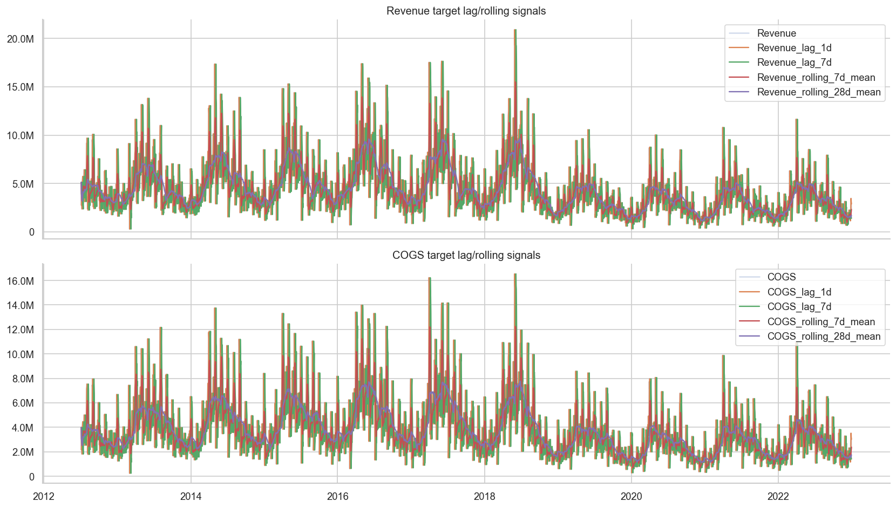

Nhận xét:

- Target lag bám khá sát xu hướng của target thật.
- Đây là lý do baseline đã mạnh và nhiều feature khác khó tạo thêm gain.
- Tuy nhiên target lag chỉ phản ánh lịch sử gần nhất, chưa giải thích hết các thay đổi do demand, return, shipment, geography.

Source lag theo family:

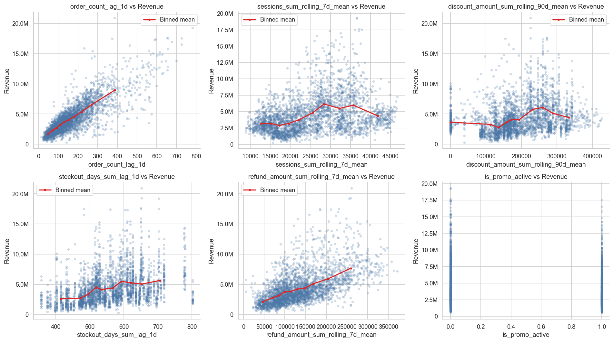

Nhận xét:

- Nhiều source lag có quan hệ rõ với target nhưng nhiễu hơn target lag.
- Source lag hữu ích khi nó bổ sung thông tin mới, ví dụ hoạt động review/return/shipment/geography.
- Các nhóm như traffic hoặc inventory có tín hiệu nhưng chưa đủ ổn định trong wrapper hiện tại.

### 7.6. Lớp 6 - Stability theo thời gian

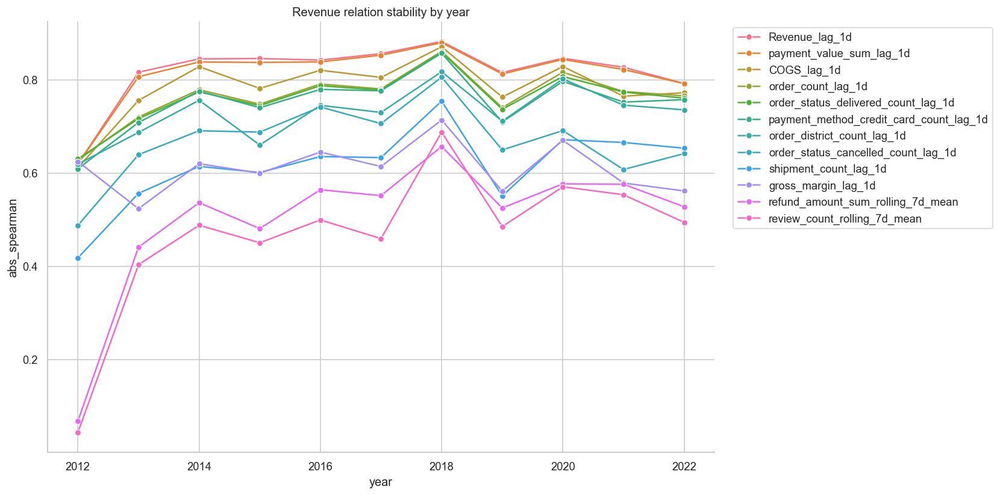

Nhận xét:

- Feature forecasting cần ổn định qua nhiều năm, không chỉ tốt ở một giai đoạn.
- Một số feature có correlation cao nhưng dao động theo năm, nên cần validation time-aware.
- Stability là lý do không chọn feature chỉ dựa vào một bảng ranking.

### 7.7. Lớp 7 - Wrapper time-aware

Wrapper kiểm tra câu hỏi quan trọng nhất:

> Sau khi đã có baseline, nhóm feature này có thật sự giúp giảm lỗi trên dữ liệu tương lai không?

Wrapper bắt đầu từ baseline:

- `Revenue_lag_1d`
- `COGS_lag_1d`
- `month`
- `day_of_week`

Sau đó thử thêm từng nhóm tín hiệu. Nếu nhóm làm giảm mean WAPE đủ rõ, nhóm đó được giữ.

Kết quả các nhóm được giữ:

| Step | Nhóm | Mean WAPE trước | Mean WAPE sau | Mức giảm |
|---:|---|---:|---:|---:|
| 1 | `review` | 0.2257 | 0.2063 | 0.0194 |
| 2 | `demand_volume` | 0.2063 | 0.2054 | 0.0009 |
| 3 | `return_refund` | 0.2054 | 0.2025 | 0.0029 |
| 4 | `shipment` | 0.2025 | 0.2009 | 0.0016 |
| 5 | `geography` | 0.2009 | 0.1997 | 0.0012 |

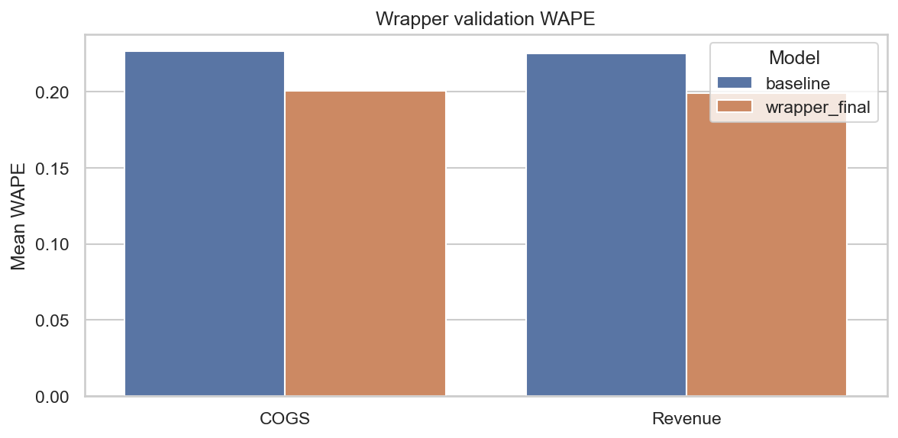

Quyết định wrapper theo nhóm:

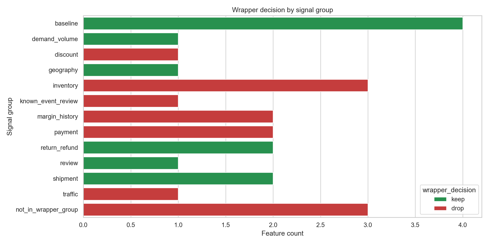

Nhận xét:

- `review` tạo cải thiện lớn nhất ở bước đầu. Điều này cho thấy tín hiệu phản hồi/hoạt động sau bán hàng có giá trị bổ sung ngoài target lag.
- `demand_volume` cải thiện nhỏ hơn vì target lag đã chứa nhiều thông tin về volume, nhưng vẫn đủ gain để giữ.
- `return_refund`, `shipment`, `geography` tiếp tục tạo incremental gain nên được giữ.
- `payment`, `traffic`, `inventory`, `discount`, `margin_history` không được giữ trong final set vì sau khi đã có các nhóm mạnh hơn, chúng không tạo thêm WAPE gain đủ ổn định.

### 7.8. Feature set cuối cùng

Feature cuối cùng gồm 11 biến:

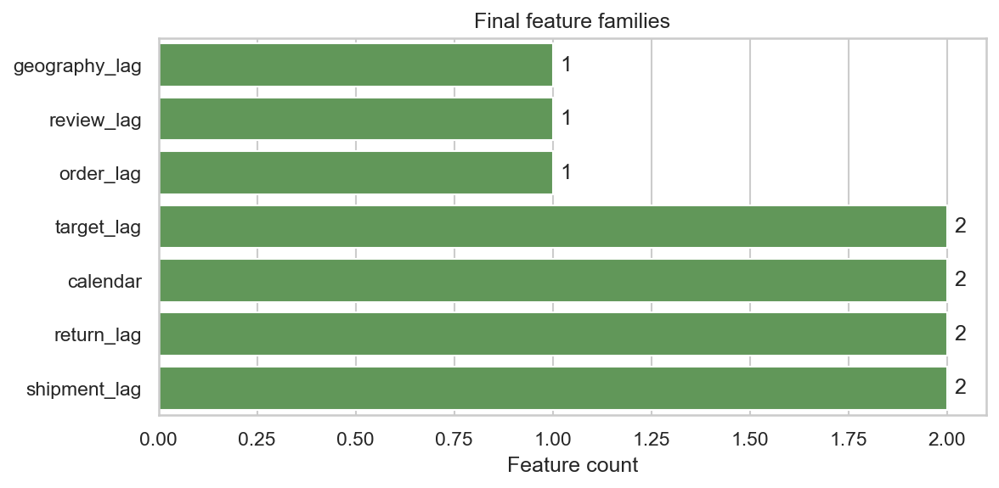

| Feature | Nhóm | Lý do giữ |
|---|---|---|
| `Revenue_lag_1d` | Target history | Baseline mạnh, leakage-safe |
| `COGS_lag_1d` | Target history | Baseline mạnh, leakage-safe |
| `order_count_lag_1d` | Demand volume | Đại diện nhu cầu mua hàng hôm trước |
| `order_district_count_lag_1d` | Geography | Đại diện độ phủ địa lý đơn hàng |
| `shipment_count_lag_1d` | Shipment | Đại diện khối lượng giao hàng |
| `shipping_fee_sum_lag_1d` | Shipment | Đại diện quy mô vận chuyển |
| `refund_amount_sum_rolling_7d_mean` | Return/refund | Đại diện quy mô hoàn tiền gần đây |
| `review_count_rolling_7d_mean` | Review | Đại diện tương tác/phản hồi gần đây |
| `return_count_rolling_7d_mean` | Return/refund | Đại diện xu hướng hàng trả lại |
| `month` | Calendar | Biết trước, bắt mùa vụ theo tháng |
| `day_of_week` | Calendar | Biết trước, bắt chu kỳ ngày trong tuần |

Kết luận phần feature selection:

- Không chọn feature theo cảm tính.
- Không chọn chỉ vì Spearman cao.
- Không giữ quá nhiều feature trùng tín hiệu.
- Chỉ giữ feature vừa leakage-safe, vừa có ý nghĩa business, vừa qua được validation time-aware.

## 8. Phase 6-7: Train model và đánh giá

### 8.1. Model được so sánh

Ba nhóm model/logic được dùng:

| Model | Vai trò | Công thức/ý tưởng |
|---|---|---|
| `Naive_lag_1d` | Baseline tối thiểu | `y_hat_t = y_(t-1)` |
| `Ridge` | Model tuyến tính kiểm tra feature | Tuyến tính + L2 regularization |
| `Main_model` | Model chính theo plan | Dự kiến LightGBM, hiện fallback do thiếu package |

Lưu ý quan trọng:

- Theo plan, model chính nên là LightGBM vì phù hợp với dữ liệu tabular và quan hệ phi tuyến.
- Nhưng môi trường hiện tại thiếu `sklearn`, `lightgbm`, `joblib`.
- Vì vậy `Main_model` hiện tại chưa phải LightGBM thật; kết quả hiện tại chủ yếu dùng để kiểm tra pipeline và sức mạnh feature set.

### 8.2. Kết quả metric trên test 2021-2022

| Model | Target | MAE | RMSE | WAPE |
|---|---|---:|---:|---:|
| Naive_lag_1d | Revenue | 686,699.67 | 1,039,279.64 | 0.2265 |
| Ridge | Revenue | 619,282.70 | 942,412.14 | 0.2043 |
| Main_model | Revenue | 623,402.84 | 945,566.29 | 0.2057 |
| Naive_lag_1d | COGS | 613,707.16 | 931,970.62 | 0.2284 |
| Ridge | COGS | 554,762.84 | 850,200.90 | 0.2065 |
| Main_model | COGS | 555,723.07 | 850,750.38 | 0.2068 |

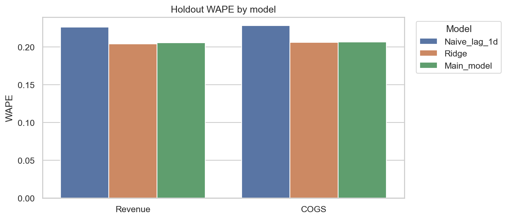

Nhận xét:

- Ridge tốt hơn baseline trên cả hai target.
- `Revenue` WAPE giảm từ 0.2265 xuống 0.2043, cải thiện tương đối khoảng 9.8%.
- `COGS` WAPE giảm từ 0.2284 xuống 0.2065, cải thiện tương đối khoảng 9.6%.
- `Main_model` hơi kém Ridge vì hiện tại chưa chạy đúng LightGBM thật.

Kết luận:

- Feature set có ích vì model tuyến tính đã thắng baseline.
- Nhưng chưa thể kết luận model chính tốt nhất cho đến khi chạy LightGBM thật.

### 8.3. Actual vs predicted

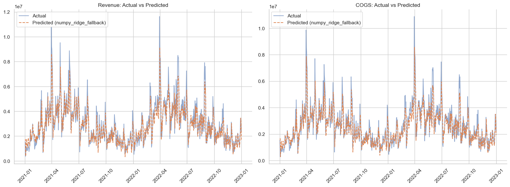

Nhận xét:

- Model bám được xu hướng chính của `Revenue` và `COGS`.
- Các spike lớn vẫn là điểm khó, đặc biệt khi actual tăng/giảm mạnh hơn mẫu hình lịch sử.
- Đây là dấu hiệu cần thêm phân tích lỗi theo thời gian và theo sự kiện.

### 8.4. Sai số theo thời gian

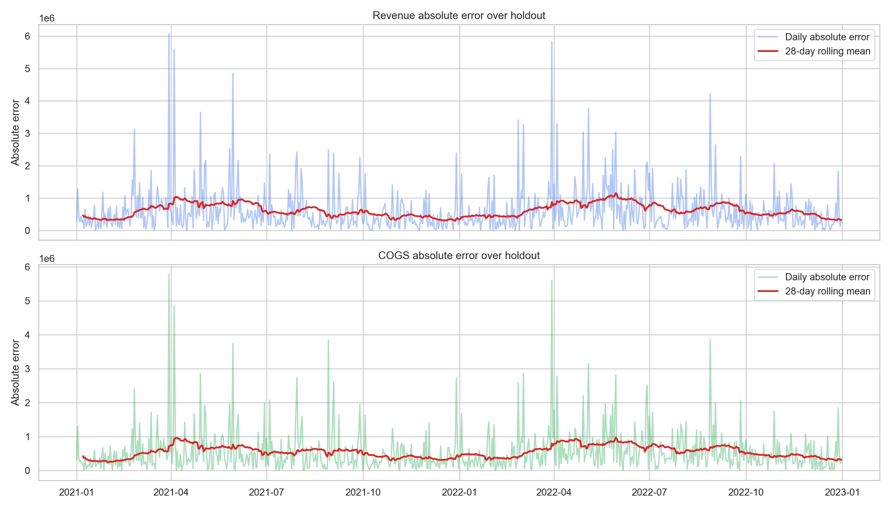

Nhận xét:

- Sai số không đều theo thời gian. Có nhiều giai đoạn model hoạt động ổn, nhưng một số ngày spike làm lỗi tăng mạnh.
- Rolling absolute error giúp thấy giai đoạn nào model mất ổn định, thay vì chỉ nhìn một WAPE tổng.
- Các spike lớn có thể liên quan đến promotion, holiday, thay đổi demand, hoặc sự kiện vận hành chưa được feature hiện tại mô tả đủ.

### 8.5. Phân phối residual

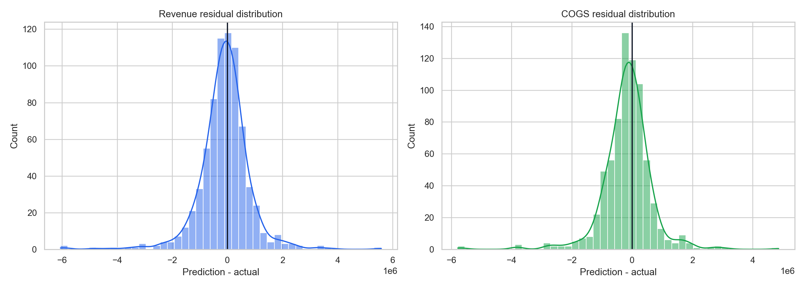

Nhận xét:

- Residual tập trung quanh 0 nhưng có tail dài.
- Tail dài giải thích vì sao RMSE cao hơn MAE: một số ngày sai rất lớn bị RMSE phạt mạnh.
- Đây là lý do không nên chỉ báo cáo MAE; cần xem thêm RMSE và biểu đồ lỗi.

### 8.6. WAPE theo tháng

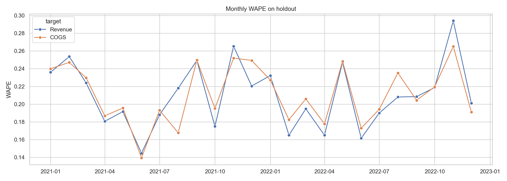

Nhận xét:

- Một số tháng có WAPE cao hơn rõ rệt, ví dụ 2021-02, 2021-09, 2021-11, 2022-05, 2022-11.
- Lỗi theo tháng cho thấy model chưa ổn định đều trên toàn bộ holdout.
- Cần phân tích xem các tháng lỗi cao có liên quan tới mùa vụ, khuyến mãi, holiday hoặc biến động giao dịch không.

### 8.7. Top ngày lỗi lớn

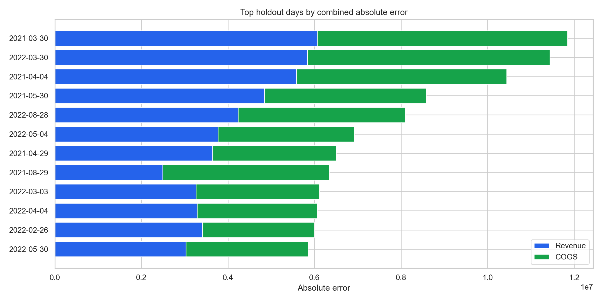

Một số ngày có combined absolute error rất lớn:

| Ngày | Nhận xét |
|---|---|
| 2021-03-30 | Actual rất cao nhưng model dự báo thấp hơn nhiều |
| 2022-03-30 | Tương tự, spike lớn chưa được model bắt đủ |
| 2021-04-04 | Model dự báo cao hơn actual nhiều |
| 2021-05-30 | Actual cao, model thấp |
| 2022-08-28 | Actual cao, model thấp |

Kết luận:

- Model đã cải thiện lỗi trung bình, nhưng vẫn yếu ở các ngày cực trị.
- Bước tiếp theo nên tập trung vào error analysis cho spike days, không chỉ tune model chung chung.

## 9. Đánh giá theo mục tiêu dự báo

### 9.1. Mục tiêu 1 - Dữ liệu có sạch và dùng được không?

Đạt mức dùng được cho modeling ban đầu.

Lý do:

- Đã clean trước khi tạo target.
- Đã kiểm tra missing sau clean.
- Không fill bừa target.
- Train/test chia theo thời gian và không overlap.

Điểm cần làm tiếp:

- Audit sâu hơn các ngày target spike.
- Kiểm tra các ngày có `margin_rate` bất thường.

### 9.2. Mục tiêu 2 - Feature có leakage-safe không?

Đạt.

Lý do:

- Same-day operational feature được loại khỏi nhóm dùng trực tiếp.
- Source feature được chuyển sang lag/rolling.
- Calendar/known-now được giữ vì biết trước.
- Train/test không trộn quá khứ và tương lai.

Điểm cần làm tiếp:

- Khi dự báo `sample_submission`, phải đảm bảo mọi feature đều có thể tạo được tại horizon dự báo.
- Nếu feature cần thông tin tương lai, phải bỏ hoặc thay bằng planned/lagged version.

### 9.3. Mục tiêu 3 - Feature selection có rõ ràng không?

Đạt, nhưng đây vẫn là phần cần trình bày kỹ nhất khi báo cáo.

Logic chọn feature:

1. Lọc feature không an toàn hoặc chất lượng kém.
2. Tính quan hệ với `Revenue` và `COGS`.
3. Gom feature theo business signal.
4. Giữ biến đại diện để tránh trùng thông tin.
5. Dùng wrapper time-aware để kiểm tra incremental WAPE gain.

Điểm quan trọng cần nói khi thuyết trình:

- Feature Spearman cao vẫn có thể bị loại nếu nó trùng thông tin với target lag hoặc nhóm đã chọn.
- Payment là ví dụ rõ: có quan hệ đơn biến mạnh, nhưng wrapper không giữ vì sau baseline và các nhóm khác, nó không tạo thêm gain đủ ổn định.
- Nhóm được giữ không chỉ vì correlation, mà vì làm giảm WAPE trong validation theo thời gian.

### 9.4. Mục tiêu 4 - Model hiện tại có đáng tin để đi tiếp không?

Đủ tin để đi tiếp, nhưng chưa phải kết quả cuối.

Lý do:

- Ridge thắng baseline naive trên cả `Revenue` và `COGS`.
- Feature set chứng minh có thêm tín hiệu ngoài `lag_1d`.
- Tuy nhiên `Main_model` chưa chạy đúng LightGBM.
- Model vẫn yếu ở spike days và một số tháng WAPE cao.

## 10. Kết luận chính

Sau hai ngày thực hiện, pipeline đã chuyển từ dữ liệu thô sang một bộ dữ liệu modeling có kiểm soát:

- Dữ liệu đã được clean trước khi tạo target.
- Target daily đã rõ ràng.
- Feature engineering đã đảm bảo leakage-safe.
- Feature selection có nhiều lớp kiểm chứng, không chọn cảm tính.
- Bộ feature cuối cùng gồm 11 biến, vừa gọn vừa có ý nghĩa nghiệp vụ.
- Ridge cải thiện WAPE khoảng 9-10% so với baseline trên test 2021-2022.

Kết luận quan trọng nhất:

> Bộ feature hiện tại đủ tốt để làm nền cho modeling tiếp theo, nhưng model cuối chưa nên chốt vì LightGBM chưa chạy thật và lỗi ở spike days vẫn còn lớn.

## 11. Hướng làm tiếp theo

### 11.1. Chạy lại model chính đúng môi trường

Cần cài hoặc chạy trong môi trường có:

- `scikit-learn`
- `lightgbm`
- `joblib`

Sau đó chạy lại `train_model.ipynb` để lấy kết quả LightGBM thật.

### 11.2. Error analysis trước khi tune sâu

Ưu tiên phân tích:

- Top ngày lỗi lớn.
- Tháng có WAPE cao.
- Ngày holiday/promotion.
- Ngày spike doanh thu/COGS.
- Ngày model over-predict và under-predict mạnh.

Mục tiêu là hiểu model sai vì thiếu feature nào, không chỉ tăng độ phức tạp model.

### 11.3. Kiểm tra lại nhóm feature bị loại

Sau khi có LightGBM thật, nên kiểm tra lại:

- `payment`
- `traffic`
- `inventory`
- `discount`
- `margin_history`

Lý do: Ridge tuyến tính có thể chưa khai thác hết quan hệ phi tuyến của các nhóm này. LightGBM có thể dùng được một phần tín hiệu nếu tương tác với calendar/promotion/demand.

### 11.4. Chuẩn bị inference cho horizon dự báo

Khi đi tới dự báo thật:

- Chỉ dùng feature biết trước hoặc có thể tính từ lịch sử.
- Không dùng order/payment/shipment/return/review cùng ngày nếu chưa biết tại thời điểm dự báo.
- Với các feature không thể tạo cho horizon tương lai, cần bỏ hoặc thay bằng lag/rolling/planned version.

## 12. Tóm tắt trình bày ngắn gọn

Có thể trình bày với reviewer như sau:

"Pipeline được xây dựng theo hướng leakage-safe cho bài toán forecasting. Sau khi load và clean 14 bảng nguồn, nhóm tạo target daily cho Revenue và COGS, sau đó tạo feature biết trước và feature quá khứ bằng lag/rolling. Các feature cùng ngày từ operational data không được dùng trực tiếp để tránh leakage. Từ 491 candidate feature, nhóm lọc theo chất lượng, tương quan với target, business signal, redundancy và cuối cùng dùng wrapper time-aware để kiểm tra incremental WAPE gain. Feature set cuối gồm 11 biến, đại diện cho target history, demand volume, return/refund, review, shipment, geography và calendar. Trên test 2021-2022, Ridge cải thiện WAPE khoảng 9-10% so với baseline lag 1 ngày. Kết quả này chứng minh feature set có giá trị, nhưng model chính cần chạy lại LightGBM thật và phân tích sâu các ngày spike để cải thiện bước tiếp theo."

