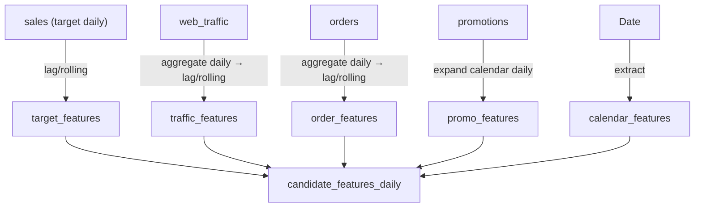

# Kế hoạch Feature Engineering — `feature_engineering.ipynb`

> **Bước này nằm trong pipeline**: Feature Engineering + Leakage Control (Bước 03–04 trong `ds_project_pipeline.md`).
> **Đầu vào**: kết quả EDA từ `report_4_6_2026` — đã chọn target (`Revenue`, `COGS`), xác nhận forecast grain daily, kết luận H1–H4, và feature candidate catalog.
> **Đầu ra**: một bảng `candidate_features_daily.csv` chứa tất cả feature candidates ở grain daily, sẵn sàng cho bước Feature Screening & Selection.

---

## Tổng quan quy trình

```text
Phase 1 — Load dữ liệu
Phase 2 — Clean data (nhẹ, đủ cho FE, không redo check_quality)
Phase 3 — Feature Engineering
    3.1  Tạo bảng target daily (sales)
    3.2  Aggregate từng bảng nguồn về grain daily và tạo lag/rolling/known-now features
    3.3  Merge tất cả thành master candidate table
Phase 4 — Feature Screening & Selection
    4.1  Feature catalog & quality filter
    4.2  Univariate relevance (Spearman, binned-mean, rules)
    4.3  Redundancy & multicollinearity filter
    4.4  Stability check theo thời gian
    4.5  Wrapper time-aware (incremental WAPE) — optional Cycle 1
    4.6  Chốt feature set & audit report
```

> **Nguyên tắc xuyên suốt**:
> - Mọi feature phải available **trước ngày dự báo** (known-now hoặc lagged). Same-day realized values **không** được dùng làm feature.
> - Mọi aggregate phải về grain **daily** trước khi join với `sales`.
> - Mỗi bước join phải kiểm tra row count trước/sau (`validate="1:1"` hoặc `validate="m:1"`).
> - Không tự fill missing nếu chưa có lý do business.

---

# Phase 1 — Load dữ liệu

## Mục tiêu

Nạp tất cả bảng cần dùng cho Feature Engineering, xác nhận schema cơ bản, và ghi rõ vai trò của từng bảng.

## Các bảng cần load

| Bảng | File | Vai trò trong FE | Quyết định từ EDA |
|---|---|---|---|
| `sales` | `data/sales.csv` | **Bảng target** — chứa `Date`, `Revenue`, `COGS` | H1 supported — dùng tạo target + lag/rolling |
| `sample_submission` | `data/sample_submission.csv` | **Forecast frame** — xác định forecast period | Dùng để tạo skeleton forecast dates |
| `web_traffic` | `data/web_traffic.csv` | Bảng giao dịch/time-varying — tín hiệu traffic online | H2 partially_supported — candidate_if_relation |
| `orders` | `data/orders.csv` | Bảng giao dịch — order volume | H3 supported_with_leakage_warning — candidate_only_lagged |
| `promotions` | `data/promotions.csv` | Bảng calendar — lịch khuyến mãi | H4 partially_supported — candidate |

| `products` | `data/products.csv` | Bảng master/lookup — hỗ trợ enrichment | Không đứng riêng, chỉ lookup |
| `order_items` | `data/order_items.csv` | Bảng chi tiết đơn hàng | Chỉ dùng nếu cần aggregate product-mix features |

### Các bước thực hiện

1. Load từng bảng bằng `du.read_csv()`.
2. In `shape`, `head(3)`, `dtypes` cho mỗi bảng.
3. Xác nhận tên cột khớp với kỳ vọng từ EDA.
4. Tạo bảng `load_summary`:

| table | rows | cols | date_col | grain_expected | note |
|---|---|---|---|---|---|
| sales | ? | ? | Date | daily | target table |
| web_traffic | ? | ? | date | date × traffic_source | cần aggregate |
| orders | ? | ? | order_date | 1 order/row | cần aggregate |
| promotions | ? | ? | start_date, end_date | 1 campaign/row | cần expand calendar |
| ... | | | | | |

### KL Phase 1

```text
Phase 1 hoàn thành khi tất cả bảng được load, schema không có surprise so với EDA, và load_summary được ghi lại.
```

---

# Phase 2 — Clean data

## Mục tiêu

Thực hiện cleaning tối thiểu đủ để tạo feature chính xác. **Không** redo toàn bộ check_quality — chỉ xử lý những vấn đề ảnh hưởng trực tiếp đến grain, join key, và phép tính aggregate.

## Nguyên tắc cleaning trong FE

| Loại cleaning | Làm ở đây? | Lý do |
|---|---|---|
| Strip tên cột, chuẩn hóa kiểu date/numeric | ✅ | Cần cho join và aggregate |
| Xử lý chuỗi rỗng → NaN | ✅ | Tránh sai aggregate |
| Drop duplicate hoàn toàn | ✅ | Tránh nhân dòng |
| Xử lý outlier target (Revenue < 0, COGS < 0) | ✅ Flag, không drop tùy tiện | Cần biết để quyết định impute/cap sau |
| Xử lý missing target | ✅ Flag | Không fill target tùy tiện |
| Clean text categories | ❌ | Thuộc check_quality |
| FK integrity check | ❌ | Thuộc check_quality |

## Các bước thực hiện

### 2.1 Chuẩn hóa kiểu dữ liệu

```text
Với mỗi bảng:
1. Convert date columns → datetime (dùng du.convert_columns())
2. Convert numeric columns → float/int
3. Ghi conversion_report
```

**Bảng cần convert**:

| Bảng | Date columns | Numeric columns |
|---|---|---|
| `sales` | `Date` | `Revenue`, `COGS` |
| `web_traffic` | `date` | `sessions`, `unique_visitors`, `page_views`, `bounce_rate`, `avg_session_duration_sec` |
| `orders` | `order_date` | (không có numeric target ở đây) |
| `promotions` | `start_date`, `end_date` | `discount_percentage` |

### 2.2 Drop duplicate hoàn toàn

```text
Với mỗi bảng:
1. Đếm duplicate trước
2. Drop duplicate
3. In số dòng trước/sau
```

### 2.3 Flag anomalies target

```text
Trong sales:
1. Flag ngày có Revenue ≤ 0
2. Flag ngày có COGS ≤ 0
3. Flag ngày có COGS > Revenue (margin âm)
4. Ghi bảng target_anomaly_flags
5. KHÔNG drop — giữ lại cho modeling tự quyết
```

### 2.4 Tạo metrics phụ trợ từ target

```text
sales['Gross_Profit'] = sales['Revenue'] - sales['COGS']
sales['Gross_Margin'] = sales['Gross_Profit'] / sales['Revenue']  # dùng du.safe_div()
```

### Output Phase 2

- `clean_summary.csv`: bảng, bước clean, trước/sau, ghi chú
- `target_anomaly_flags.csv`: ngày, Revenue, COGS, flag

### KL Phase 2

```text
Phase 2 hoàn thành khi date/numeric đã convert đúng, duplicate đã drop, anomalies target đã flag, và clean_summary đã ghi lại. Không drop dòng nào vì outlier target — chỉ flag.
```

---

# Phase 3 — Feature Engineering

## Mục tiêu

Tạo tất cả feature candidates ở grain daily, đảm bảo mọi feature chỉ dùng thông tin available trước ngày dự báo (lagged/known-now), và merge thành một bảng master duy nhất.

## Tổng quan logic



---

## Bước 3.1 — Tạo bảng target daily và biến target history

### Mục tiêu

Tạo daily target spine từ `sales`, sau đó tạo lag và rolling features từ `Revenue`, `COGS`, `Gross_Profit`, `Gross_Margin`.

### Các bước thực hiện

1. **Xác nhận grain**: `sales.Date` phải unique ở grain ngày (đã kiểm tra EDA — PASS).
2. **Tạo target spine**:
   ```text
   target_daily = sales[['Date', 'Revenue', 'COGS', 'Gross_Profit', 'Gross_Margin']]
   ```
3. **Tạo biến lag**:
   - `Revenue_lag_1d`, `Revenue_lag_7d`, `Revenue_lag_14d`, `Revenue_lag_28d`
   - `COGS_lag_1d`, `COGS_lag_7d`, `COGS_lag_14d`, `COGS_lag_28d`
   - `Gross_Profit_lag_1d`, `Gross_Profit_lag_7d`
   - `Gross_Margin_lag_1d`, `Gross_Margin_lag_7d`
4. **Tạo biến rolling mean** (shift 1 trước khi rolling — tránh leakage):
   - `Revenue_rolling_7d_mean`, `Revenue_rolling_28d_mean`
   - `COGS_rolling_7d_mean`, `COGS_rolling_28d_mean`
   - `Gross_Profit_rolling_7d_mean`, `Gross_Profit_rolling_28d_mean`
   - `Gross_Margin_rolling_7d_mean`, `Gross_Margin_rolling_28d_mean`
5. **Tạo biến diff/change** (optional nhưng hữu ích):
   - `Revenue_diff_1d = Revenue_lag_1d - Revenue_lag_2d` (thay đổi ngày-qua-ngày)
   - `Revenue_pct_change_7d` = (Revenue_lag_1d - Revenue_lag_7d) / Revenue_lag_7d

> **Leakage control**: tất cả lag đều dùng `shift(n)` với `n ≥ 1`, rolling dùng `shift(1)` rồi `.rolling()`. Giá trị ngày t chỉ dùng lag từ ngày t-1 trở về trước.

### Dùng hàm tiện ích

```python
target_daily, target_feat_names = du.make_lag_roll(
    target_daily, date_col='Date',
    cols=['Revenue', 'COGS', 'Gross_Profit', 'Gross_Margin'],
    lags=[1, 7, 14, 28],
    windows=[7, 28]
)
```

### Kiểm tra output

- Số dòng `target_daily` = số dòng `sales` gốc.
- Các dòng đầu (khi chưa đủ lag) phải là NaN — **không fill**.
- Print `target_daily.isna().sum()` để xác nhận pattern NaN hợp lý.

### Output Bước 3.1

- DataFrame `target_daily` với cột `Date` + tất cả target lag/rolling features.
- Danh sách `target_feat_names`.

---

## Bước 3.2 — Aggregate từng bảng nguồn về grain daily

### Mục tiêu

Đưa từng bảng nguồn có grain khác nhau về cùng forecast grain daily trước khi merge. Đây là bước kiểm soát rủi ro nhân dòng: không join raw `web_traffic`, `orders` hoặc `promotions` trực tiếp vào `sales`, vì các bảng này có thể là one-to-many theo ngày.

### Quy trình

- Xác nhận grain gốc của từng bảng nguồn trước khi aggregate.
- Aggregate `web_traffic` từ `date × traffic_source` về `traffic_daily`.
- Aggregate `orders` từ `1 dòng = 1 order` về `orders_daily`.
- Expand `promotions` từ campaign interval về `promo_calendar_daily`.
- Tạo calendar features trực tiếp từ `Date` của target spine.
- Kiểm tra mỗi output daily có key ngày unique trước khi sang bước merge.
- Ghi `daily_aggregate_checks.csv` để audit rows, date range, unique key và số feature tạo ra.

### Input và output

| Source | Grain gốc | Output daily | Key sau aggregate | Feature policy |
|---|---|---|---|---|
| `web_traffic` | `date × traffic_source` | `traffic_daily` | `date` unique | Chỉ dùng lag/rolling traffic volume để giảm leakage |
| `orders` | 1 dòng = 1 order | `orders_daily` | `order_date` unique | Chỉ dùng lag/rolling order signal, không dùng same-day order count |
| `promotions` | 1 dòng = 1 campaign | `promo_calendar_daily` | `date` unique | Same-day calendar feature được dùng vì thường biết trước |
| `Date` từ target spine | 1 dòng = 1 ngày | `calendar_features` | `Date` unique | Calendar feature là known-now |

### Nguyên tắc chung

```text
Mỗi bảng nguồn:
1. Xác nhận grain gốc
2. Aggregate về daily (1 dòng = 1 ngày)
3. Kiểm tra Date unique sau aggregate
4. CHƯA join với sales ở bước này — chỉ tạo bảng daily aggregate riêng
```

---

### 3.2.1 — `web_traffic` → `traffic_daily`

**Grain gốc**: `date × traffic_source` (EDA đã xác nhận)

**Aggregate rules**:

| Cột gốc | Aggregation | Lý do |
|---|---|---|
| `sessions` | `sum` | Tổng sessions từ tất cả sources |
| `unique_visitors` | `sum` | Tổng unique visitors (xấp xỉ vì có overlap) |
| `page_views` | `sum` | Tổng pageviews |
| `bounce_rate` | `mean` (weighted by sessions nếu có) | Tỷ lệ — **không sum** |
| `avg_session_duration_sec` | `mean` (weighted by sessions nếu có) | Trung bình — **không sum** |

**Weighted mean cho tỷ lệ** (chuẩn hơn mean đơn giản):
```text
bounce_rate_daily = sum(bounce_rate * sessions) / sum(sessions)
avg_session_duration_daily = sum(avg_session_duration_sec * sessions) / sum(sessions)
```

**Kiểm tra**:
- `traffic_daily.date.nunique() == len(traffic_daily)` → PASS
- Coverage: `traffic_daily` bắt đầu từ 2013-01-01 (thiếu 6 tháng đầu so với sales) — đã biết từ EDA

**Tạo lag/rolling cho traffic**:
```text
traffic_daily, traffic_feat_names = du.make_lag_roll(
    traffic_daily, date_col='date',
    cols=['sessions', 'unique_visitors', 'page_views'],
    lags=[1, 7, 14, 28],
    windows=[7, 28]
)
```

> **Không tạo lag/rolling cho `bounce_rate`, `avg_session_duration_sec`** trừ khi EDA cho thấy chúng có signal — rolling trung bình tỷ lệ cần weighted rolling, phức tạp hơn.

---

### 3.2.2 — `orders` → `orders_daily`

**Grain gốc**: 1 dòng = 1 order (EDA đã xác nhận)

**Aggregate rules**:

| Metric daily | Phép tính | Lý do |
|---|---|---|
| `order_count` | `count(order_id)` | Tổng số đơn trong ngày |
| `unique_customer_count` | `nunique(customer_id)` | Số khách hàng unique |
| `order_by_source_*` | `count` group by `order_source` | Breakdown theo kênh (pivot hoặc group count) |
| `order_by_device_*` | `count` group by `device_type` | Breakdown theo thiết bị |
| `order_by_payment_*` | `count` group by `payment_method` | Breakdown theo phương thức thanh toán |
| `order_by_status_*` | `count` group by `order_status` | Breakdown theo trạng thái |

> **Lưu ý**: Chỉ giữ các breakdown nếu cardinality thấp (< 10 categories). Nếu cardinality cao, chỉ giữ top categories.

**Leakage warning** (từ H3):
- `order_count` same-day là realized value — **không dùng làm feature forecast**.
- Chỉ dùng **lagged** order features: `order_count_lag_1d`, `order_count_rolling_7d_mean`, v.v.

**Tạo lag/rolling**:
```text
orders_daily, order_feat_names = du.make_lag_roll(
    orders_daily, date_col='order_date',
    cols=['order_count', 'unique_customer_count'],
    lags=[1, 7, 14, 28],
    windows=[7, 28]
)
```

**Kiểm tra**:
- `orders_daily.order_date.nunique() == len(orders_daily)` → PASS
- Coverage: orders cover toàn bộ train period (EDA đã xác nhận)

---

### 3.2.3 — `promotions` → `promo_calendar_daily`

**Grain gốc**: 1 dòng = 1 campaign (50 campaigns tổng cộng)

**Logic tạo daily calendar**:
```text
1. Với mỗi promotion, expand tất cả ngày từ start_date đến end_date.
2. Với mỗi ngày, aggregate:
   - active_promo_count = số promotions đang active
   - avg_active_discount = mean(discount_percentage) của các promo active
   - max_active_discount = max(discount_percentage)
   - has_stackable_promo = any(stackable == True) nếu có cột stackable
3. Ngày không có promo active → fill 0 cho count, NaN hoặc 0 cho discount.
```

**Leakage assessment**:
- Promotion calendar là **known-now** (lịch khuyến mãi thường biết trước) → an toàn dùng same-day.
- Promo usage (bao nhiêu item dùng mã giảm giá) là realized → **không dùng**.

**Không cần lag/rolling cho promo calendar** vì:
- Promo calendar là known-now, không cần shift.
- Có thể tạo thêm: `days_since_last_promo_end`, `days_until_next_promo_start` nếu muốn capture after-effect.

**Kiểm tra**:
- Mỗi ngày trong calendar chỉ 1 dòng.
- Ngày ngoài bất kỳ promotion nào → `active_promo_count = 0`.

---

### 3.2.4 — Calendar features từ `Date`

**Không cần bảng nguồn** — tạo trực tiếp từ cột `Date` của target spine.

**Features cần tạo**:

| Feature | Cách tạo | Lý do |
|---|---|---|
| `day_of_week` | `Date.dt.dayofweek` (0=Mon, 6=Sun) | H1: weekly seasonality |
| `is_weekend` | `day_of_week >= 5` → 1/0 | H1: weekend pattern |
| `month` | `Date.dt.month` | H1: monthly seasonality |
| `quarter` | `Date.dt.quarter` | H1: quarterly pattern |
| `year` | `Date.dt.year` | H1: trend theo năm |
| `day_of_month` | `Date.dt.day` | Pattern lương/chi tiêu đầu tháng |
| `day_of_year` | `Date.dt.dayofyear` | Long-run seasonality |
| `week_of_year` | `Date.dt.isocalendar().week` | Weekly granularity |
| `is_month_start` | `Date.dt.is_month_start` → 1/0 | Spike đầu tháng? |
| `is_month_end` | `Date.dt.is_month_end` → 1/0 | Spike cuối tháng? |
| `sin_day_of_week` | `sin(2π × day_of_week / 7)` | Cyclical encoding |
| `cos_day_of_week` | `cos(2π × day_of_week / 7)` | Cyclical encoding |
| `sin_month` | `sin(2π × month / 12)` | Cyclical encoding |
| `cos_month` | `cos(2π × month / 12)` | Cyclical encoding |

> **Cyclical encoding**: tháng 12 và tháng 1 thực sự "gần nhau" — sin/cos encoding capture điều này tốt hơn raw integer.

**Leakage**: Calendar features là known-now → an toàn.

---


## Bước 3.3 — Merge thành master candidate table

### Mục tiêu

Join tất cả daily aggregate/features vào target spine thành một bảng `candidate_features_daily` duy nhất.

### Thứ tự merge

```text
1. Bắt đầu từ target_daily (Date, Revenue, COGS, Gross_Profit, Gross_Margin, target_lags, target_rollings)
2. LEFT JOIN traffic_daily ON Date = date
3. LEFT JOIN orders_daily ON Date = order_date
4. LEFT JOIN promo_calendar_daily ON Date = date
5. Calendar features tạo trực tiếp trên Date (không cần join)
```

### Kiểm tra sau mỗi merge

| Kiểm tra | Expected | Hành động nếu FAIL |
|---|---|---|
| Row count sau join = row count trước join | Luôn PASS vì LEFT JOIN 1:1 | Dừng, debug grain |
| `validate="1:1"` không raise error | PASS | Dừng, kiểm tra duplicate date ở bảng phải |
| Cột NaN mới chỉ xuất hiện ở coverage gap đã biết | Traffic thiếu 6 tháng đầu | Ghi nhận, không fill tùy tiện |

### Xử lý coverage gaps

| Bảng | Coverage gap | Chiến lược |
|---|---|---|
| `web_traffic` | 2012-07-04 đến 2012-12-31 không có traffic | Giữ NaN — **không impute**. Model tree-based xử lý NaN được. Ghi note. |
| `promotions` | Nhiều ngày không có promo active | Fill `active_promo_count = 0`, `avg_active_discount = 0` — vì "không có promo" là thông tin thật. |
| `orders` | Full coverage | Không cần xử lý |

### Output Bước 3.3

- DataFrame `candidate_features_daily` với `Date` + target + tất cả features.
- `feature_catalog.csv`: danh sách features, source table, type (lag/rolling/calendar/known-now), leakage risk.

### KL Phase 3

```text
Phase 3 hoàn thành khi:
- Mỗi bảng nguồn đã aggregate về daily grain.
- Lag/rolling đã shift ≥ 1 ngày (không leak same-day target value).
- Promotion calendar fill 0 cho ngày không có promo (known-now, an toàn).
- Coverage gaps đã ghi nhận, không tự impute tùy tiện.
- Tất cả merge đều validate 1:1 và row count giữ nguyên.
- candidate_features_daily có 1 dòng = 1 ngày từ train period.
```

---

# Phase 4 — Feature Screening & Selection

## Mục tiêu

Từ danh sách feature candidates, sàng lọc để giữ lại những features:
1. Có chất lượng đủ (không quá nhiều missing, variance > 0).
2. Có quan hệ có ý nghĩa với target (Revenue/COGS).
3. Không redundant (không lặp thông tin lẫn nhau quá mức).
4. Ổn định qua thời gian (signal không mất ở giai đoạn gần nhất).

## Bước 4.1 — Feature catalog & quality filter

### Rules loại feature

| Condition | Action | Lý do |
|---|---|---|
| Missing > 60% | Flag REVIEW | Quá nhiều dòng không có giá trị |
| Variance = 0 (constant) | DROP | Không có signal |
| Nunique = 1 | DROP | Đồng nghĩa constant |
| Feature = biến target (Revenue, COGS, Gross_Profit, Gross_Margin) | EXCLUDE khỏi features | Đây là target, không phải feature |
| Feature = same-day realized value | DROP | Leakage |

### Output

- `feature_quality_filter.csv`: feature, missing_pct, variance, nunique, action (KEEP/DROP/REVIEW)

---

## Bước 4.2 — Univariate relevance

### Phương pháp

1. **Spearman correlation** với `Revenue` và `COGS` (dùng `du.target_relation_report()`).
2. **Binned mean plot** cho top features (dùng `du.plot_feature_vs_target()`).
3. **Rule-based screening**:
   - `|Spearman| < 0.05` → DROP (quá yếu)
   - `|Spearman| >= 0.05 và < 0.10` → FLAG REVIEW
   - `|Spearman| >= 0.10` → KEEP candidate

### Masked evaluation (đánh giá từng biến riêng lẻ)

Với mỗi feature family (ví dụ: tất cả revenue lags), mask từng biến:
```text
1. Chạy model đơn giản (Ridge hoặc LightGBM shallow) chỉ với 1 feature → ghi WAPE
2. So sánh WAPE 1-feature vs baseline (predict mean)
3. Feature nào không beat baseline → ít giá trị riêng lẻ (nhưng có thể có giá trị kết hợp)
```

> Bước masked evaluation là optional cho Cycle 1. Spearman + binned-mean đủ để sàng lọc sơ bộ.

### Output

- `feature_relevance_report.csv`: feature, Spearman_Revenue, Spearman_COGS, relation_label, action
- Biểu đồ: `fig_fe_01_spearman_bar_revenue.png`, `fig_fe_02_spearman_bar_cogs.png`
- Biểu đồ: `fig_fe_03_top_features_vs_revenue.png` (grid)

---

## Bước 4.3 — Redundancy & multicollinearity filter

### Phương pháp

1. **Correlation matrix** giữa tất cả feature candidates (Spearman, dùng `du.high_corr_pairs()`).
2. Với cặp features có `|Spearman| > 0.90`:
   - Giữ feature có Spearman với target cao hơn.
   - Drop feature còn lại.
   - Ưu tiên giữ feature ít missing hơn nếu target relation ngang nhau.
3. **Family cap**: mỗi signal family (ví dụ: revenue lags) không nên có quá 3–4 biến. Giữ biến đa dạng nhất (1d, 7d, 28d) thay vì tất cả.

### Ví dụ áp dụng family cap

| Family | Candidates | Giữ (đề xuất) | Lý do |
|---|---|---|---|
| Revenue lag | lag_1d, 7d, 14d, 28d | lag_1d, 7d, 28d | 14d thường redundant với 7d |
| Revenue rolling | rolling_7d, 28d | rolling_7d, 28d | Đã ít, giữ cả |
| COGS lag | lag_1d, 7d, 14d, 28d | lag_1d, 7d, 28d | Tương tự Revenue |
| Traffic sessions | lag_1d, 7d, rolling_7d, 28d | lag_1d, rolling_7d | Traffic yếu hơn, giảm noise |

### Output

- `redundancy_pairs.csv`: feature_a, feature_b, abs_corr, kept, dropped
- `feature_family_cap.csv`: family, original_count, kept_count, features_kept
- Biểu đồ: `fig_fe_04_correlation_heatmap.png`

---

## Bước 4.4 — Stability check theo thời gian

### Phương pháp

1. Chia data theo năm (dùng `du.temporal_relation_report()`).
2. Tính Spearman(feature, Revenue) cho mỗi năm.
3. Feature "ổn định" = Spearman không đổi dấu hoặc biến mất ở các năm gần nhất.
4. Feature "bất ổn" = signal chỉ xuất hiện ở giai đoạn đầu nhưng mất ở cuối → FLAG.

### Output

- `feature_stability_report.csv`: feature, spearman_by_year, stable_flag
- Biểu đồ: `fig_fe_05_stability_lines.png`

---

## Bước 4.5 — Wrapper time-aware (Optional Cycle 1)

### Mục tiêu

Dùng model đơn giản + rolling-origin validation để kiểm tra incremental WAPE khi thêm từng nhóm feature.

### Phương pháp

1. **Baseline**: chỉ dùng target lag/rolling → ghi WAPE baseline.
2. **Add calendar features** → ghi WAPE.
3. **Add traffic features** → ghi WAPE.
4. **Add order features** → ghi WAPE.
5. **Add promo features** → ghi WAPE.
6. Nhóm nào làm WAPE xấu đi hoặc không cải thiện đáng kể → xem xét drop.

> **Validation scheme**: rolling-origin (train trên dữ liệu trước mốc T, test 30 ngày sau T, slide T).

### Output

- `wrapper_incremental_wape.csv`: feature_group, wape_without, wape_with, delta, decision
- Biểu đồ: `fig_fe_06_incremental_wape.png`

---

## Bước 4.6 — Chốt feature set & audit report

### Tạo bảng cuối

1. **`selected_features.csv`**: danh sách features cuối cùng với metadata.

| feature | source | type | leakage_risk | quality_pass | relevance_pass | stability_pass | final_decision |
|---|---|---|---|---|---|---|---|
| Revenue_lag_1d | sales | lag | low | PASS | strong | stable | KEEP |
| sessions_rolling_7d_mean | web_traffic | rolling | low (lagged) | PASS | medium | stable | KEEP |
| active_promo_count | promotions | known-now | low | PASS | weak-medium | stable | KEEP |
| ... | | | | | | | |

2. **`dropped_features.csv`**: features bị loại với lý do.

| feature | drop_reason | evidence |
|---|---|---|
| Revenue_lag_14d | redundant with lag_7d | abs_corr 0.95 |
| bounce_rate_daily | low relevance | Spearman 0.03 |
| ... | | |

3. **`feature_engineering_audit.csv`**: tổng hợp toàn bộ quy trình.

| step | input_features | output_features | dropped | reason_summary |
|---|---|---|---|---|
| quality_filter | N | N-k | k | constant/high_missing |
| relevance_filter | N-k | N-k-m | m | Spearman < 0.05 |
| redundancy_filter | ... | ... | ... | abs_corr > 0.90 |
| stability_filter | ... | ... | ... | unstable signal |
| wrapper (opt.) | ... | ... | ... | no WAPE improvement |

4. **Xuất `candidate_features_daily.csv`** — bảng cuối cùng chỉ chứa `Date`, target columns, và selected features.

### KL Phase 4

```text
Phase 4 hoàn thành khi:
- Feature catalog đã liệt kê tất cả candidates.
- Quality filter đã loại constant/high-missing.
- Relevance filter đã loại features Spearman < 0.05.
- Redundancy filter đã giảm features trùng lặp thông tin.
- Stability check đã flag features bất ổn.
- Wrapper time-aware (nếu chạy) đã confirm incremental value.
- Audit report tổng hợp toàn bộ pipeline FE.
- candidate_features_daily.csv sẵn sàng cho Data Preparation → Modeling.
```

---

# Checklist hoàn thành `feature_engineering.ipynb`

- [ ] Phase 1: Tất cả bảng đã load, schema confirmed.
- [ ] Phase 2: Date/numeric converted, duplicate dropped, target anomalies flagged.
- [ ] Phase 3.1: Target lag/rolling đã tạo với `shift ≥ 1`.
- [ ] Phase 3.2.1: `web_traffic` → `traffic_daily` aggregated correctly (weighted mean cho tỷ lệ).
- [ ] Phase 3.2.2: `orders` → `orders_daily` aggregated, **chỉ dùng lagged features**.
- [ ] Phase 3.2.3: `promotions` → `promo_calendar_daily` expanded, fill 0 cho ngày không promo.
- [ ] Phase 3.2.4: Calendar features tạo từ Date, bao gồm cyclical encoding.

- [ ] Phase 3.3: Merge tất cả vào `candidate_features_daily`, validate 1:1, row count giữ nguyên.
- [ ] Phase 4.1: Quality filter — loại constant/high-missing.
- [ ] Phase 4.2: Relevance — Spearman + binned-mean.
- [ ] Phase 4.3: Redundancy — corr pairs > 0.90 + family cap.
- [ ] Phase 4.4: Stability — Spearman theo năm.
- [ ] Phase 4.5: Wrapper time-aware (optional).
- [ ] Phase 4.6: Audit report + `selected_features.csv` + `candidate_features_daily.csv` xuất.
- [ ] Mọi feature đều lagged hoặc known-now — **không có same-day realized feature**.
- [ ] Mọi join đều validate grain — **không nhân dòng**.
- [ ] Coverage gaps đã document — **không fill tùy tiện**.

---

# Ghi chú phương pháp

1. **Feature Engineering ≠ Modeling**: notebook này chưa train model chính thức. Wrapper ở 4.5 chỉ dùng để đánh giá incremental value, không phải kết quả dự báo cuối cùng.

2. **Thứ tự trong pipeline**: Load → Clean → FE → Screening là thứ tự đúng. Không nhảy thẳng sang modeling khi chưa có feature set chất lượng.

3. **Same-day vs lagged**: Trong bài toán forecast trước ngày, same-day order_count hoặc traffic same-day chính là target proxy — sử dụng chúng sẽ cho validation score ảo cao nhưng thực tế deploy sẽ không có dữ liệu đó.

4. **Cyclical encoding**: Dùng sin/cos cho `day_of_week`, `month` giúp model linear capture seasonality. Model tree-based không cần nhưng không gây hại.

5. **Family cap**: Nếu cùng một signal (ví dụ Revenue history) có 10+ biến lag/rolling, chúng sẽ redundant lẫn nhau, làm model dễ overfit và chậm. Giới hạn 3–4 biến/family là thực hành tốt.
